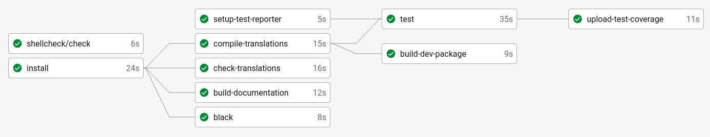
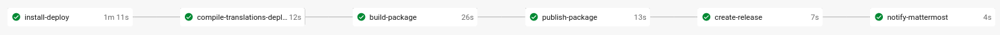

*********************************
Continuous Integration (CircleCI)
*********************************

.. admonition:: What is continuous integration?

   Continuous integration (CI) is a software development strategy that increases the speed of development while ensuring
   the quality of the code that teams deploy. Developers continually commit code in small increments (at least daily, or
   even several times a day), which is then automatically built and tested before it is merged with the shared repository.

   Source: `CircleCI documentation <https://circleci.com/continuous-integration/>`__

Configuration
=============

Our CircleCI configuration resides in :github-source:`.circleci/config.yml`.
It contains all the jobs listed below.
See `Configuring CircleCI <https://circleci.com/docs/2.0/configuration-reference/>`__ for a full reference.

Workflow ``develop``
====================

This workflow gets triggered everytime a commit is pushed to the ``develop`` branch or a PR is opened.

.. _circleci-install:

install
-------

This job executes ``pip install -e .[dev,doc,test]`` and makes use of the `CircleCI Dependency Cache <https://circleci.com/docs/2.0/caching/>`__.
It passes the virtual environment ``.venv`` to the subsequent jobs.

setup-test-reporter
-------------------

This job sets up the test coverage reporter for `CodeClimate <https://codeclimate.com/github/digitalfabrik/lunes-cms>`__.

test
----

This job runs the tests. It sets up a temporary postgres database and runs the migrations
before testing. It runs pytest and passes the coverage in the ``test-results`` directory to the build artifacts.

.. _circleci-upload-test-coverage:

upload-test-coverage
--------------------

This job joins all separate coverage data files generated from the previous steps and uploads it to `CodeClimate <https://codeclimate.com/github/digitalfabrik/lunes-cms>`__.

.. _circleci-compile-translations:

compile-translations
--------------------

This job compiles the translation file and passes the resulting ``django.mo`` to the testing and packaging job.

check-translations
------------------

This job uses the dev-tool :github-source:`tools/check_translations.sh` to check whether the translation file is up to date and
does not contain any empty or fuzzy entries.

build-dev-package
-----------------

This job creates a python package and passes the resulting files in ``dist`` to the :ref:`circleci-publish-package` job.
See :doc:`packaging` for more information.

.. _circleci-publish-package:

publish-dev-package
-------------------

This job publishes the built package to `TestPyPI <https://test.pypi.org/project/lunes-cms/>`__ via :doc:`twine:index`.
This is only executed on develop (usually after PRs have been merged) or on branches that end with ``-publish-dev-package``.

build-documentation
-------------------

This job checks whether the documentation can be generated without any errors by running
:github-source:`tools/build_documentation.sh`.

black
-----

This job executes ``black --check .``, which checks whether the code matches the :ref:`black-code-style` code style.

pylint
------

This job executes ``pylint_runner``, which checks whether the :ref:`pylint` throws any errors or warnings.

shellcheck/check
----------------

This job makes use of the `ShellCheck CircleCI Orb <https://circleci.com/developer/orbs/orb/circleci/shellcheck>`_ and
executes the pre-defined job ``shellcheck/check``. It is configured to check the directory :github-source:`tools`
and to allow external sources because all dev tools source one common function script.

Workflow ``main``
=================

This workflow gets executed when a commit is pushed to the ``main`` branch. Typically, this is a release PR from ``develop``.

install-main
------------

See :ref:`circleci-install`.

bump-version
------------

This job authenticates as the deliverino app and runs ``bumpver update`` to bump the version and commit the
changes to the main branch. Additionally, it merges the version bump commit into the ``develop`` branch.

Workflow ``deploy``
===================

This workflow gets executed when a commit is tagged.

install-deploy
--------------

See :ref:`circleci-install`.

compile-translations-deploy
---------------------------

See :ref:`circleci-compile-translations`.

publish-package
---------------

See :ref:`circleci-publish-package`. The only difference is that PyPI is used as repository instead of TestPyPI.

create-release
--------------

This job authenticates as Deliverino app and creates a GitHub release with :github-source:`.circleci/scripts/create_release.py`.

notify-mattermost
-----------------

This job sends a release notification to Mattermost into the ``releases`` channel. It needs the Mattermost
webhook which is injected via the ``mattermost`` context.

Debugging with SSH
==================

If you encounter any build failures which you cannot reproduce on your local machine, you can SSH into the build
server and examine the problem. See `Debugging with SSH <https://circleci.com/docs/2.0/ssh-access-jobs/>`__ for
more information.

.. _circleci-unauthorized:

⚠ Unauthorized (CircleCI)
=========================

.. admonition:: Got error "Unauthorized"?
    :class: error

    Some jobs need secrets that are passed into the execution via `contexts <https://circleci.com/docs/2.0/contexts/>`_.
    If you get the error "unauthorized", you have to make sure you have the correct permissions to access these secrets.
