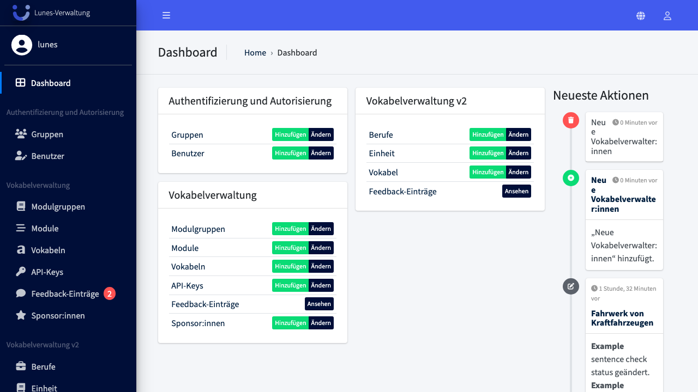
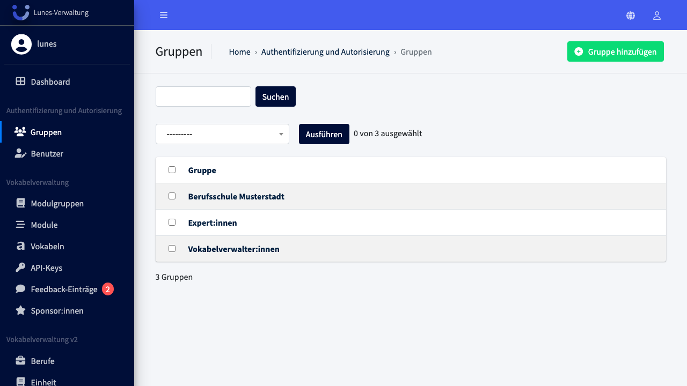
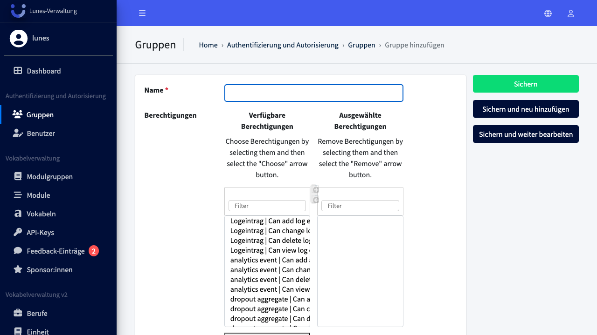
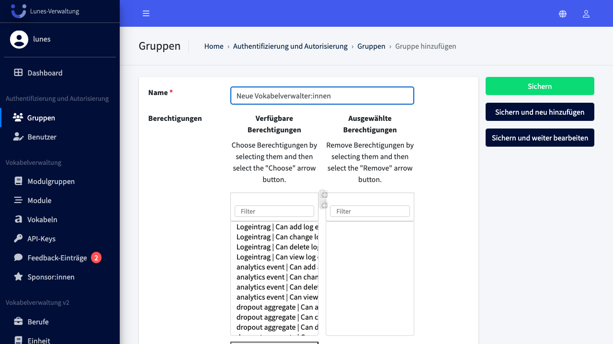
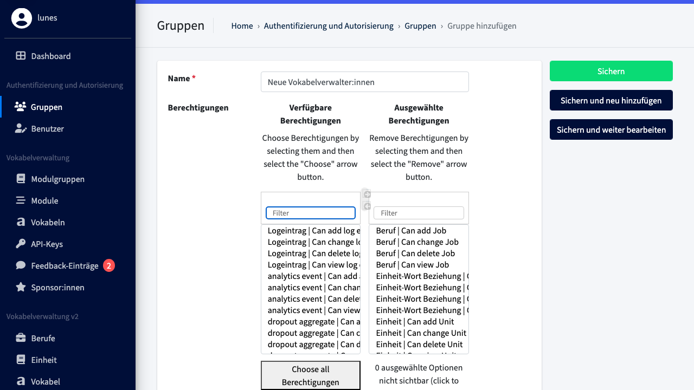

# Add Group

## Schritt 1: Gruppen-Bereich öffnen

Klicken Sie im linken Navigationsmenü im Bereich **„Authentifizierung und Autorisierung"** auf **„Gruppen"**.

## Schritt 2: Neue Gruppe anlegen

Klicken Sie oben rechts auf **„Gruppe hinzufügen"**.

## Schritt 3: Gruppenname eingeben

Geben Sie im Feld **„Name"** den Gruppennamen **„Neue Vokabelverwalter:innen"** ein.

## Schritt 4: Berechtigungen filtern und auswählen

Nutzen Sie das Suchfeld über der Berechtigungsliste, um nach Kategorien zu filtern. Wählen Sie die gefilterten Einträge aus und klicken Sie auf den Hinzufügen-Button.

## Schritt 5: Gruppe speichern

Klicken Sie auf **„Sichern"**, um die neue Gruppe anzulegen.

