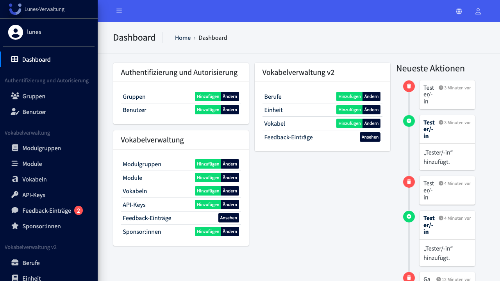
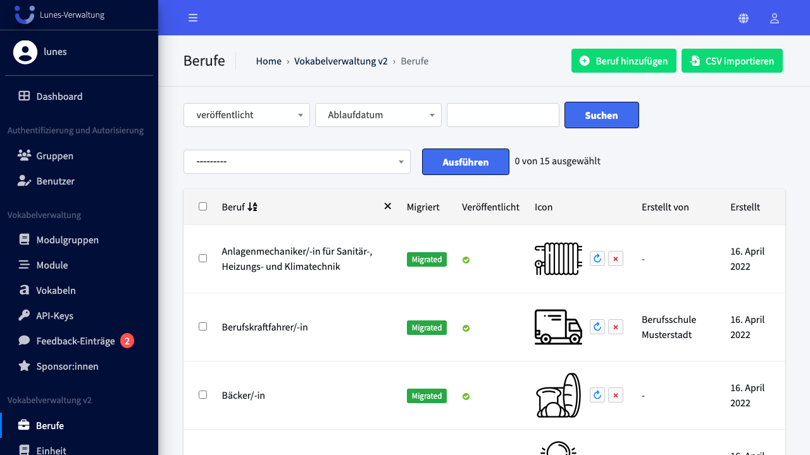
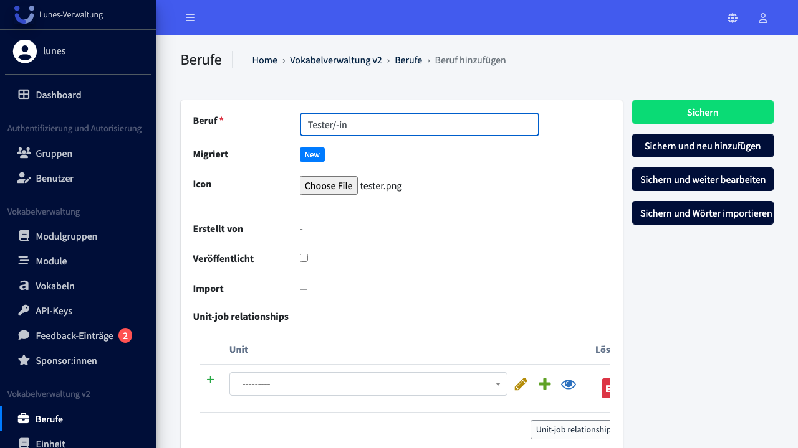
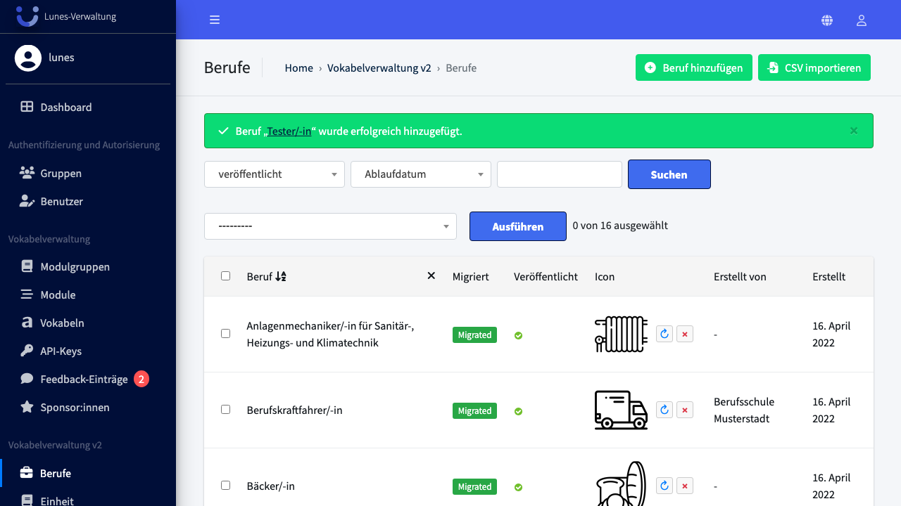

# Add Job

## Schritt 1: Berufe-Bereich öffnen

Klicken Sie im linken Navigationsmenü auf **Berufe**.

## Schritt 2: Neuen Beruf anlegen

Klicken Sie oben rechts auf den Button **„Beruf hinzufügen"**.

## Schritt 3: Beruf-Name eingeben

Geben Sie den Namen des Berufs in das Feld **„Beruf"** ein, z. B. `Tester/-in`.

## Schritt 4: Icon hochladen

Klicken Sie auf **„Durchsuchen"** neben dem Feld **„Icon"** und wählen Sie eine Bilddatei (PNG, JPG) aus.

## Schritt 5: Beruf speichern

Klicken Sie auf **„Sichern"**, um den neuen Beruf zu speichern.

## Schritt 6: Erfolg — Beruf wurde gespeichert

Der neue Beruf erscheint nun in der Berufs-Übersicht. Eine grüne Erfolgsmeldung bestätigt die Speicherung.

