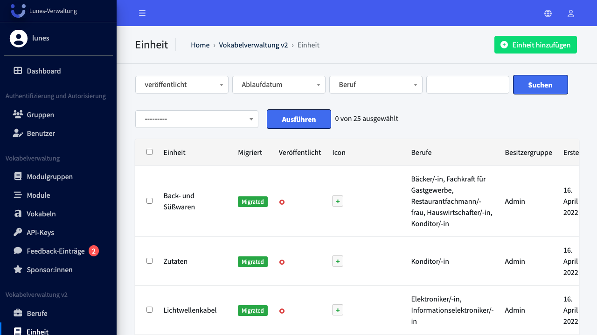
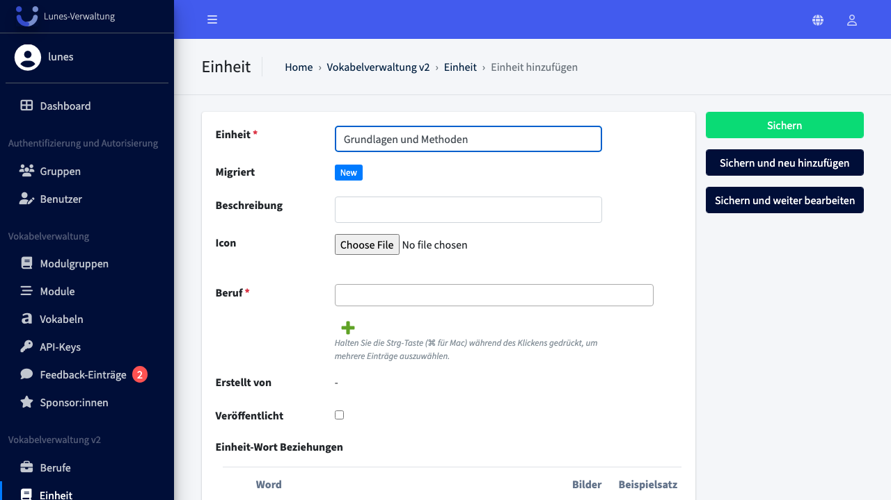
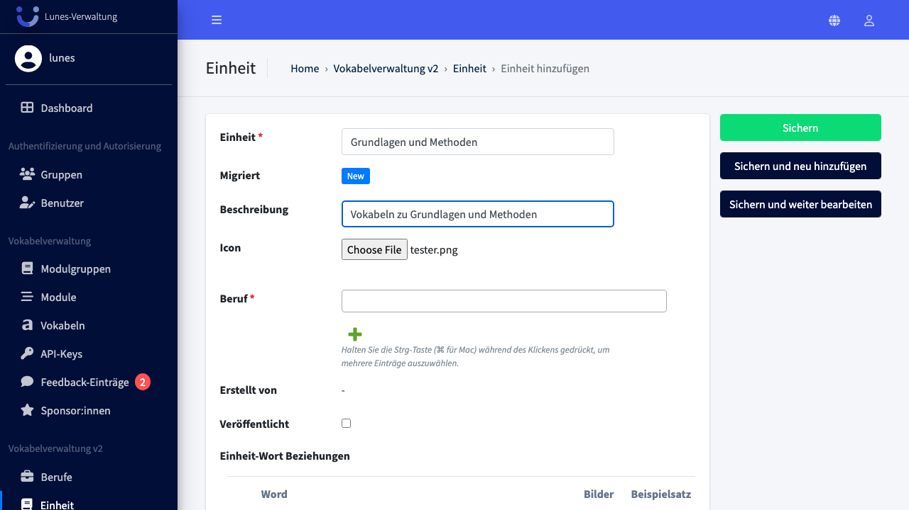
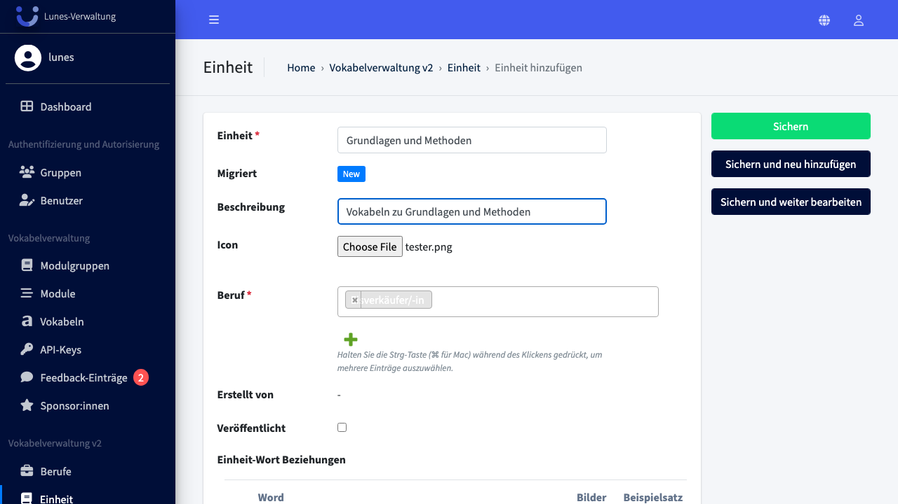
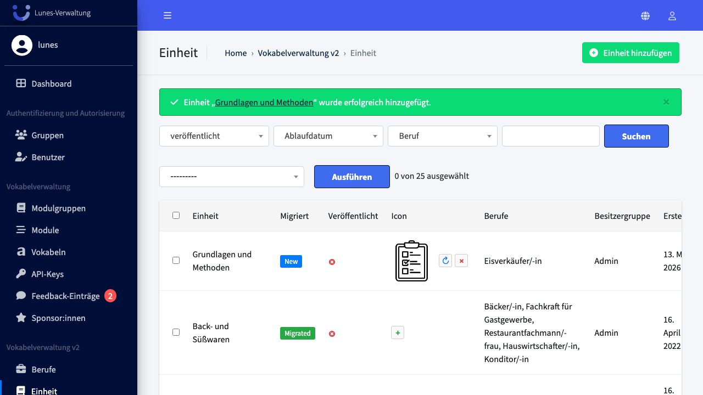

# Add Unit

## Schritt 1: Einheiten-Bereich öffnen

Klicken Sie im linken Navigationsmenü auf **Einheit**.

## Schritt 2: Neue Einheit anlegen

Klicken Sie oben rechts auf den Button **„Einheit hinzufügen"**.

## Schritt 3: Titel eingeben

Geben Sie den Titel der Einheit in das Feld **„Einheit"** ein, z. B. `Grundlagen und Methoden`.

## Schritt 4: Beschreibung eingeben

Geben Sie eine Beschreibung in das Feld **„Beschreibung"** ein.

## Schritt 5: Icon hochladen

Klicken Sie auf **„Durchsuchen"** neben dem Feld **„Icon"** und wählen Sie eine Bilddatei aus.

## Schritt 6: Beruf auswählen

Wählen Sie im Feld **„Beruf"** den Job aus zu dem die Einheit gehört z.B. **„Eisverkäufer/-in"**.

## Schritt 7: Einheit speichern

Klicken Sie auf **„Sichern"**, um die neue Einheit zu speichern.

## Schritt 8: Erfolg — Einheit wurde gespeichert

Die neue Einheit **„Grundlagen und Methoden"** erscheint nun in der Einheiten-Übersicht.

