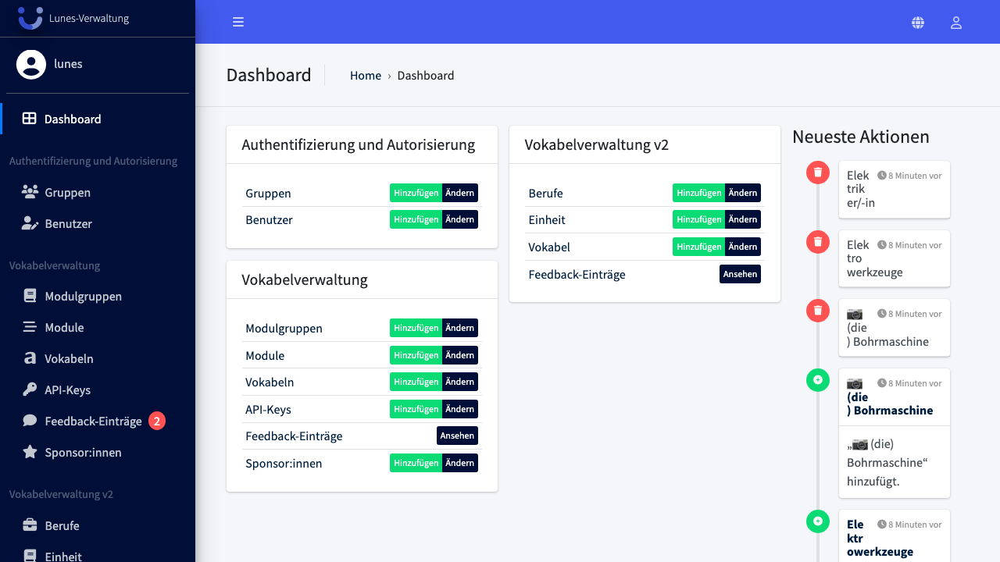
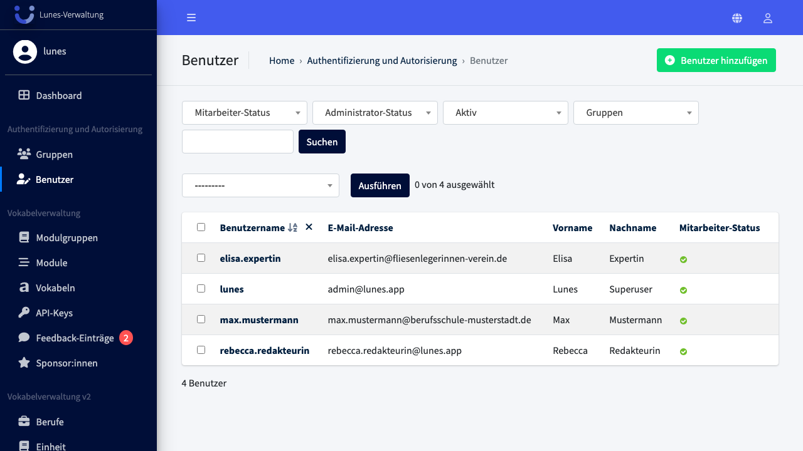
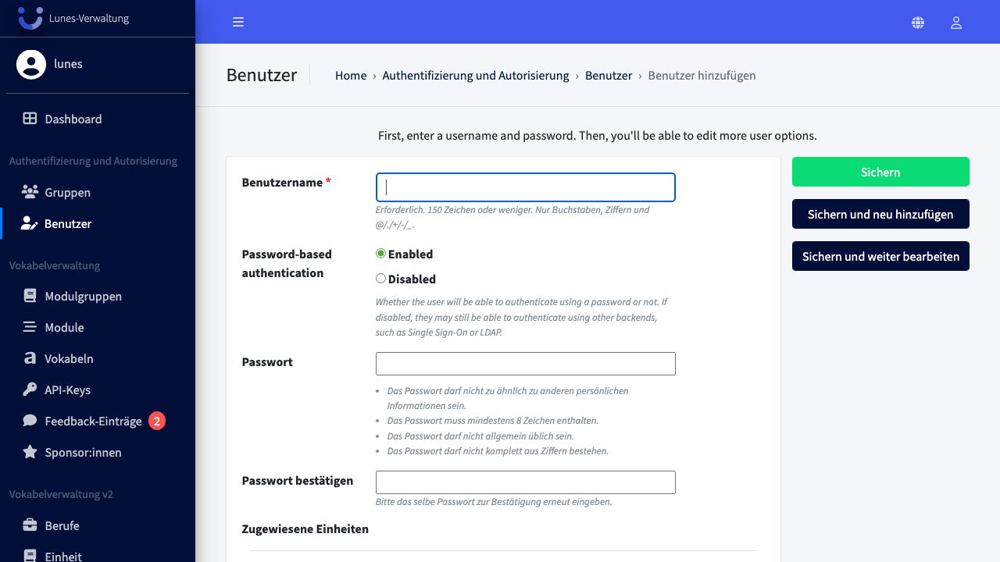

# Add User

## Schritt 1: Benutzer-Bereich öffnen

Klicken Sie im linken Navigationsmenü im Bereich **„Authentifizierung und Autorisierung"** auf **„Benutzer"**.

## Schritt 2: Neuen Benutzer anlegen

Klicken Sie oben rechts auf **„Benutzer hinzufügen"**.

## Schritt 3: Benutzerdaten eingeben

Geben Sie einen **Benutzernamen** ein. Das **Passwort** muss mindestens 8 Zeichen enthalten und darf nicht komplett aus Ziffern bestehen. Wiederholen Sie das Passwort im Feld **„Passwort bestätigen"**.

## Schritt 4: Benutzer speichern

Klicken Sie auf **„Speichern"**, um den neuen Benutzer anzulegen.

