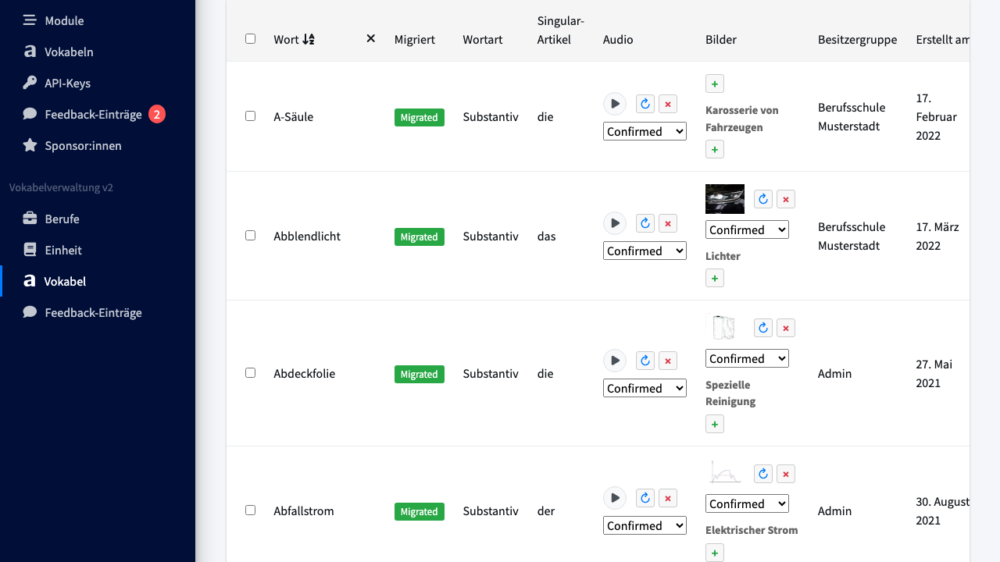
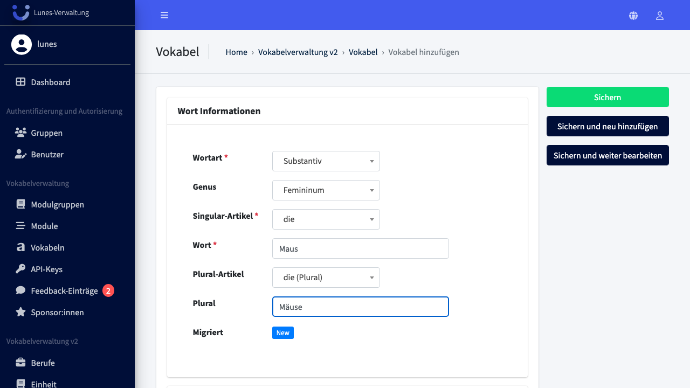
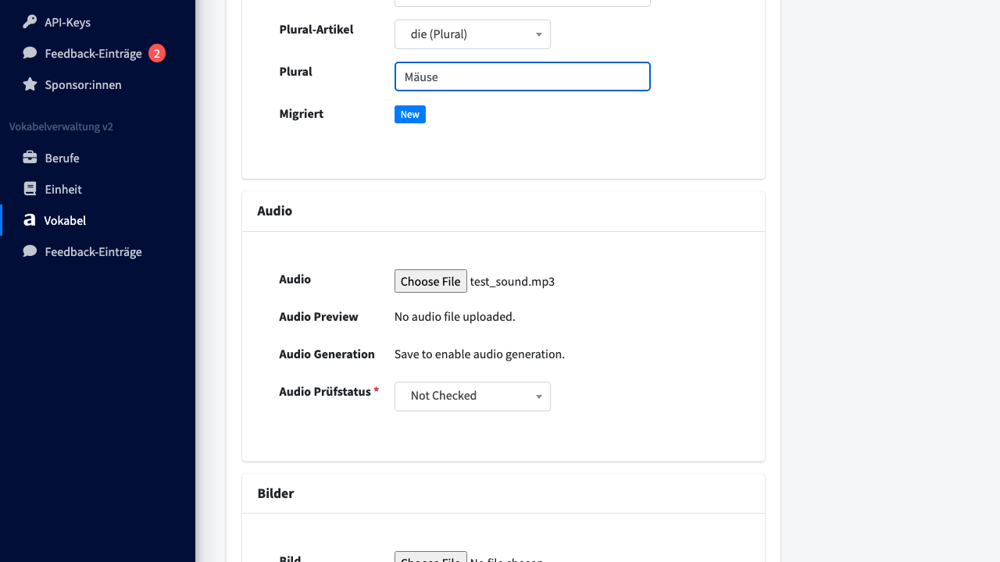
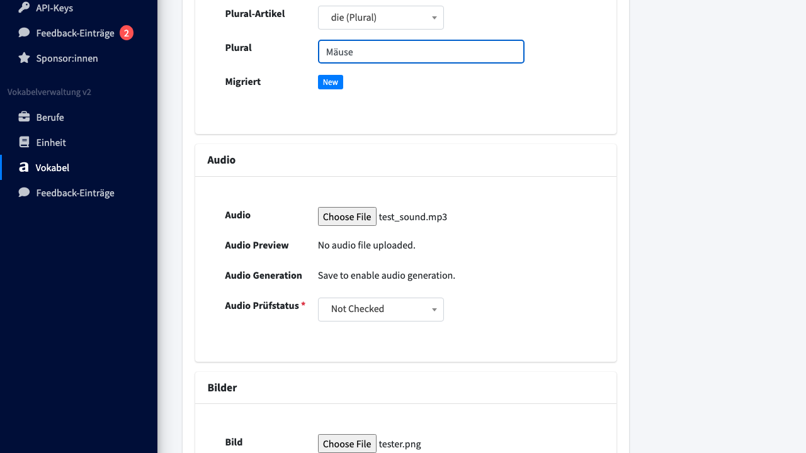
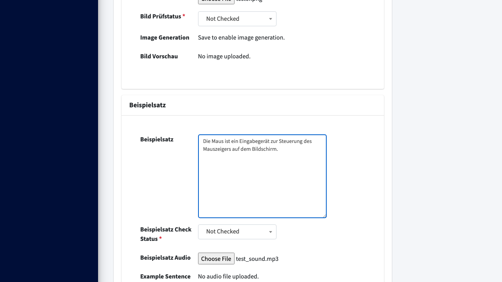
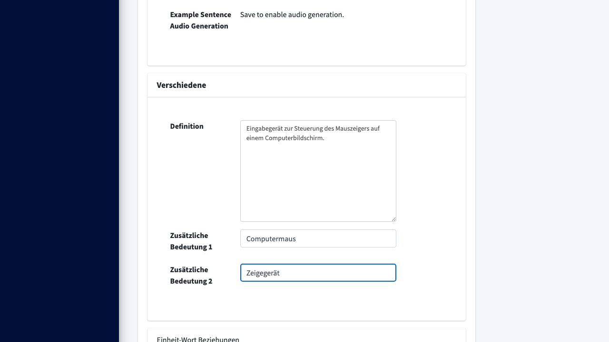
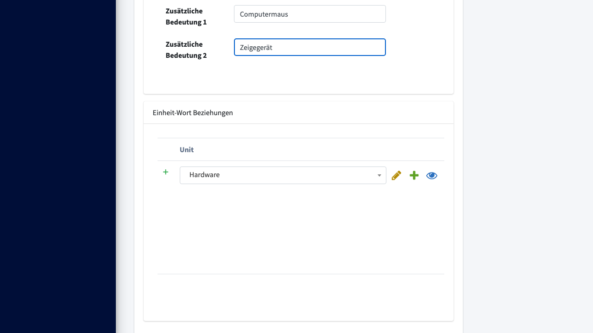
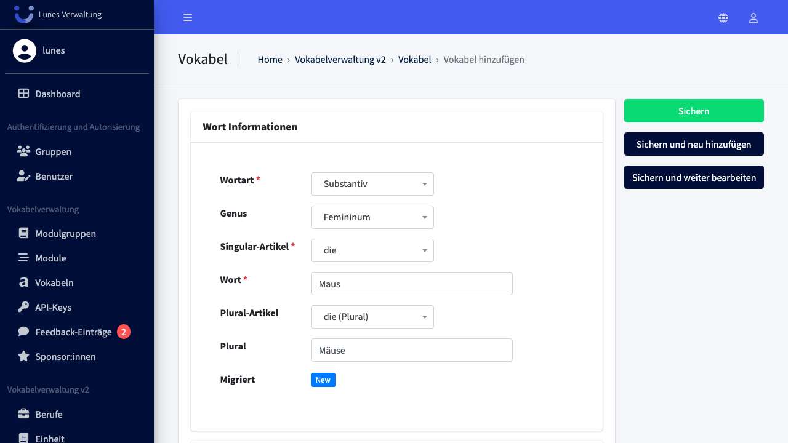
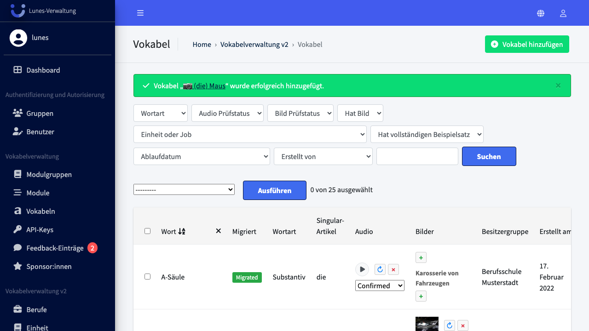

# Add Word

## Schritt 1: Vokabel-Bereich öffnen

Scrollen Sie im linken Navigationsmenü zu **Vokabel** und klicken Sie darauf.

## Schritt 2: Neues Wort anlegen

Klicken Sie oben rechts auf den Button **„Vokabel hinzufügen"**.

## Schritt 3: Vokabel Information ausfüllen

Wählen Sie den Worttyp **„Substantiv"**, das Genus **„Femininum"** und den Artikel **„die"**. Geben Sie **„Maus"** im Feld **„Word"** und **„Mäuse"** im Feld **„Plural"** ein.

## Schritt 4: Audio hochladen

Laden Sie unter **„Audio"** eine Audiodatei hoch.

## Schritt 5: Image hochladen

Laden Sie unter **„Bilder"** ein Bild hoch.

## Schritt 6: Beispielsatz eingeben (optional)

Geben Sie im Feld **„Beispielsatz"** einen Beispielsatz ein, z. B. `Die Maus ist ein Eingabegerät zur Steuerung des Mauszeigers auf dem Bildschirm.`, und laden Sie eine Audiodatei für den Beispielsatz hoch.

## Schritt 7: Verschiedenes ausfüllen (optional)

Geben Sie im Feld **„Definition"** eine Definition ein. Füllen Sie bei Bedarf auch die Felder **„Zusätzliche Bedeutung 1+2"** aus.

## Schritt 8: Einheit zuordnen

Wählen Sie im Abschnitt **„Einheit-Wort Beziehungen"** die Einheit **„Hardware"** aus.

## Schritt 9: Wort speichern

Klicken Sie auf **„Speichern"**, um das neue Wort zu speichern.

## Schritt 10: Erfolg — Wort wurde gespeichert

Das Wort **„Maus"** erscheint nun in der Wörter-Übersicht.

