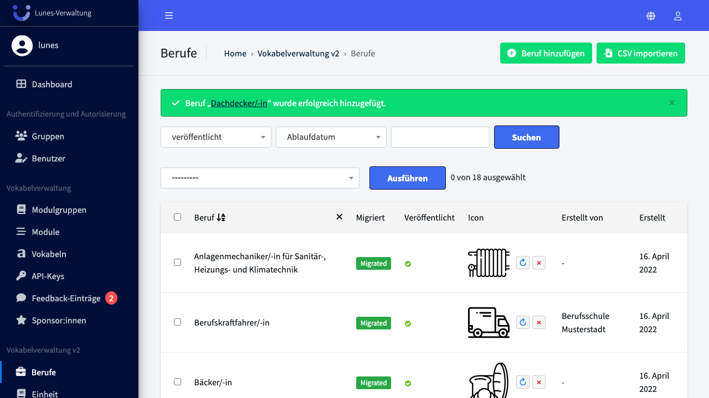
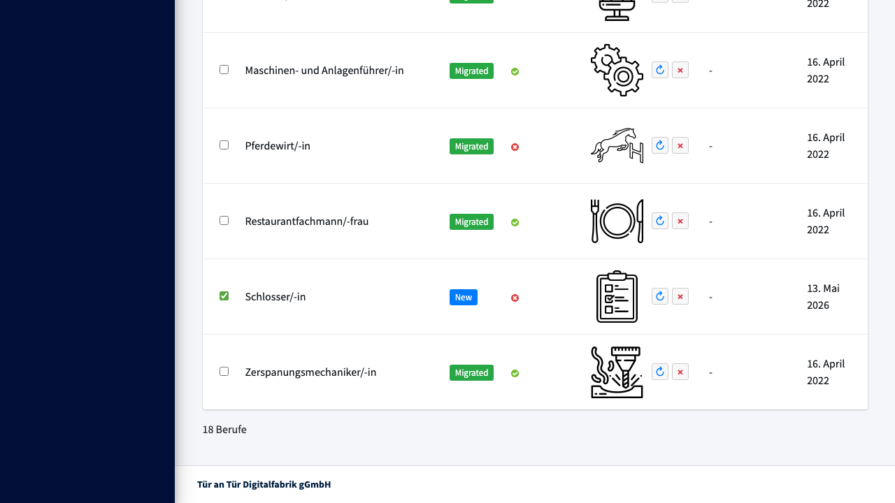
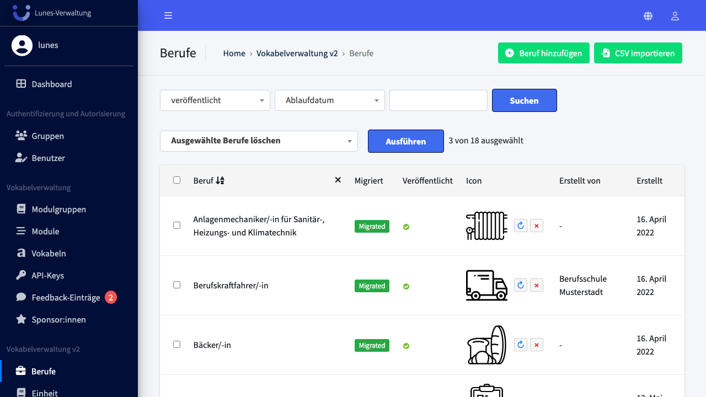
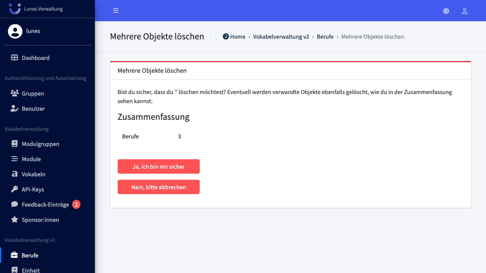
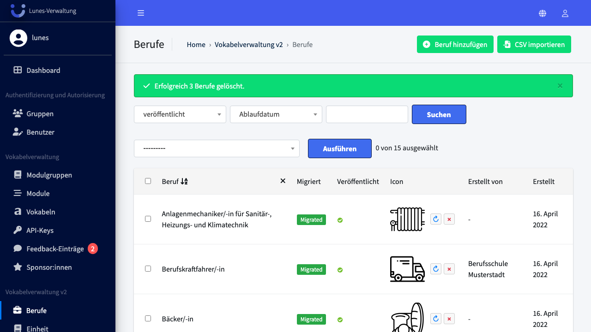

# Bulk Delete Jobs

## Schritt 1: Job-Bereich öffnen

Klicken Sie im linken Navigationsmenü auf **Berufe**.

## Schritt 2: Berufe auswählen

Aktivieren Sie die Checkboxen neben den Berufe **„Schlosser/-in"**, **„Klempner/-in"** und **„Dachdecker/-in"**.

## Schritt 3: Aktion "Ausgewählte Berufe löschen" auswählen und ausführen

Wählen Sie im Aktions-Dropdown **"Ausgewählte Berufe löschen"** aus und klicken Sie auf **„Ausführen"**.

## Schritt 4: Löschung bestätigen

Bestätigen Sie die Löschung mit einem Klick auf **„Ja, ich bin mir sicher"**.

## Schritt 5: Erfolg — Berufe wurden gelöscht

Alle drei Berufe sind nicht mehr in der Übersicht vorhanden.

