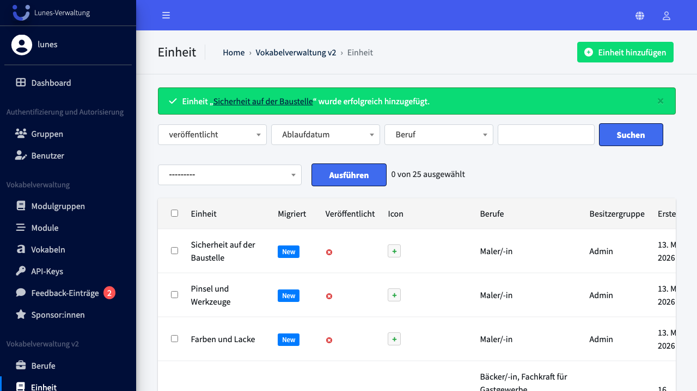
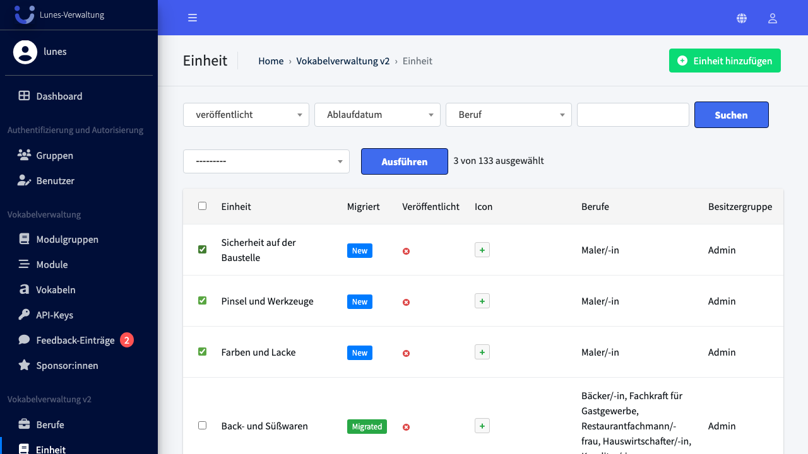
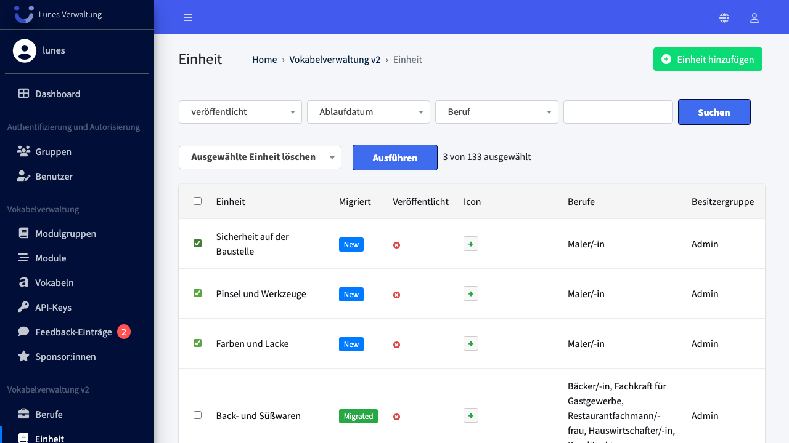
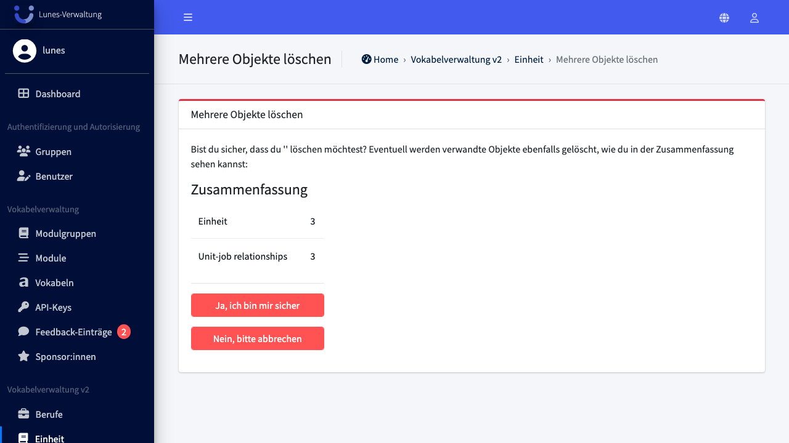
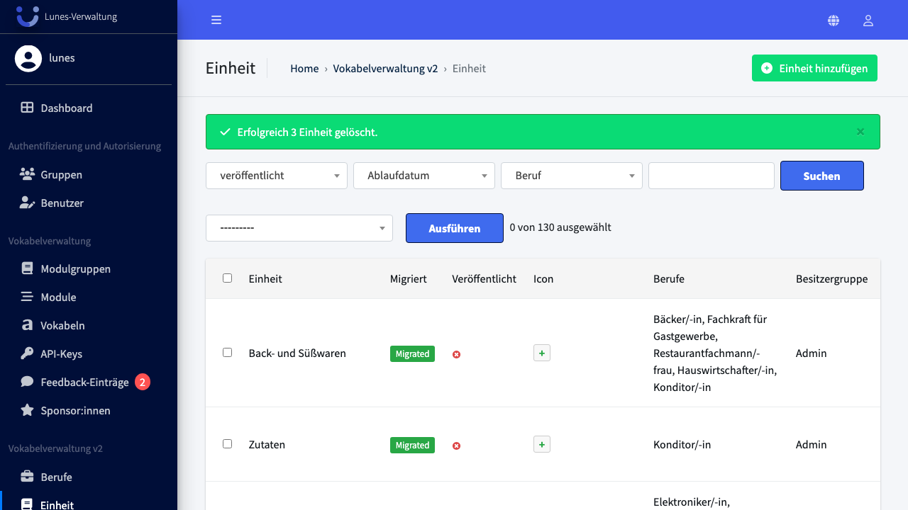

# Bulk Delete Units

## Schritt 1: Einheit-Bereich öffnen

Klicken Sie im linken Navigationsmenü auf **Einheit**.

## Schritt 2: Einheiten auswählen

Aktivieren Sie die Checkboxen neben den Einheiten **„Farben und Lacke"**, **„Pinsel und Werkzeuge"** und **„Sicherheit auf der Baustelle"**.

## Schritt 3: Aktion "Ausgewählte Einheit löschen" auswählen und ausführen

Wählen Sie im Aktions-Dropdown **"Ausgewählte Einheit löschen"** aus und klicken Sie auf **„Go"**.

## Schritt 4: Löschung bestätigen

Bestätigen Sie die Löschung mit einem Klick auf **„Ja, ich bin sicher"**.

## Schritt 5: Erfolg — Einheiten wurden gelöscht

Alle drei Einheiten sind nicht mehr in der Übersicht vorhanden.

