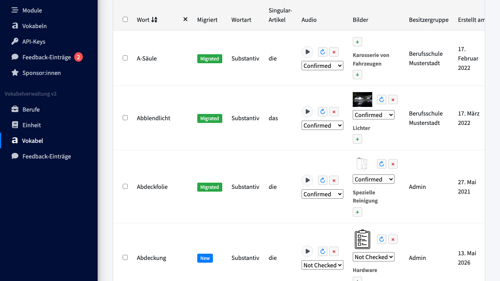
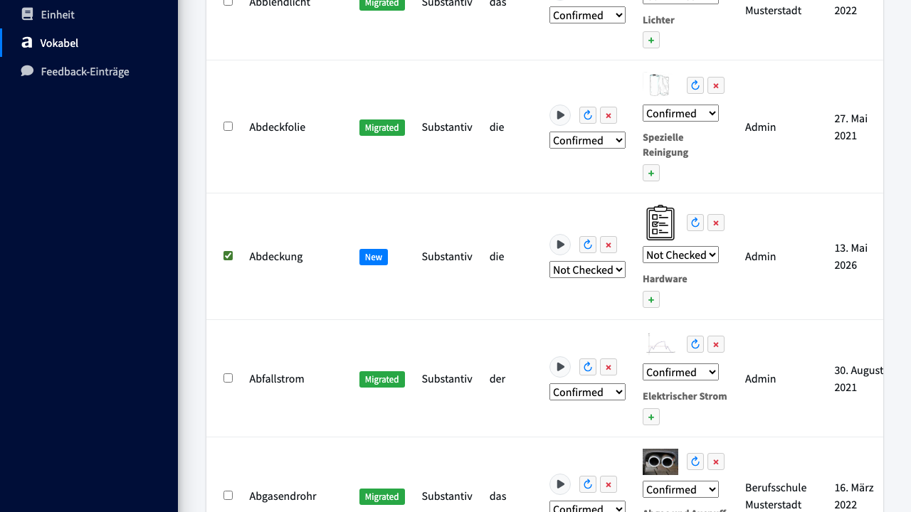
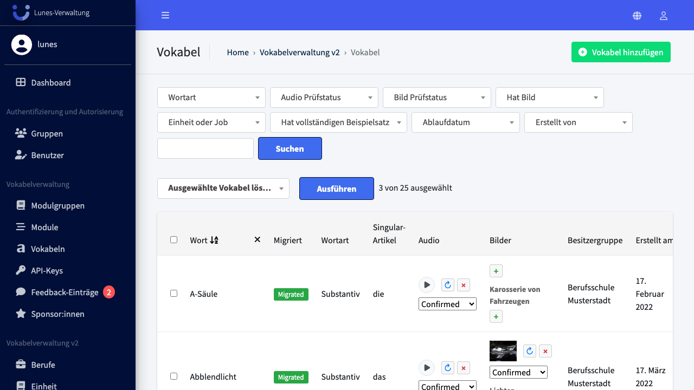
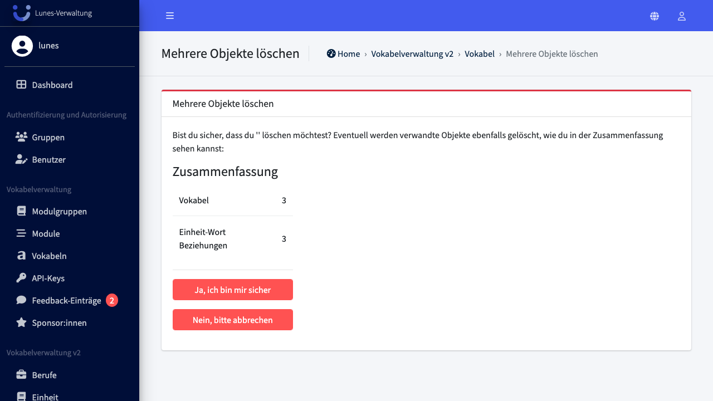
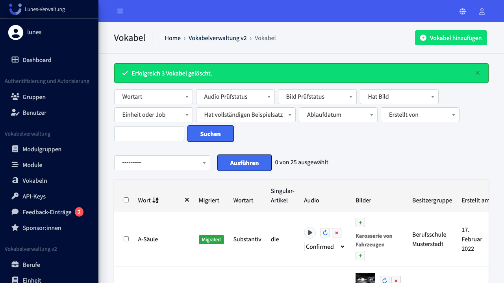

# Bulk Delete Words

## Schritt 1: Vokabel-Bereich öffnen

Scrollen Sie im linken Navigationsmenü zu **Vokabel** und klicken Sie darauf.

## Schritt 2: Vokabeln auswählen

Aktivieren Sie die Checkboxen neben den Vokabeln **„Abdeckung"**, **„Adapter"** und **„Akku"**.

## Schritt 3: Aktion "Ausgewählte Vokabeln löschen" auswählen und ausführen

Wählen Sie im Aktions-Dropdown **"Ausgewählte Vokabeln löschen"** aus und klicken Sie auf **„Ausführen"**.

## Schritt 4: Löschung bestätigen

Bestätigen Sie die Löschung mit einem Klick auf **„Ja, ich bin sicher"**.

## Schritt 5: Erfolg — Vokabeln wurden gelöscht

Alle drei Vokabeln sind nicht mehr in der Übersicht vorhanden.

