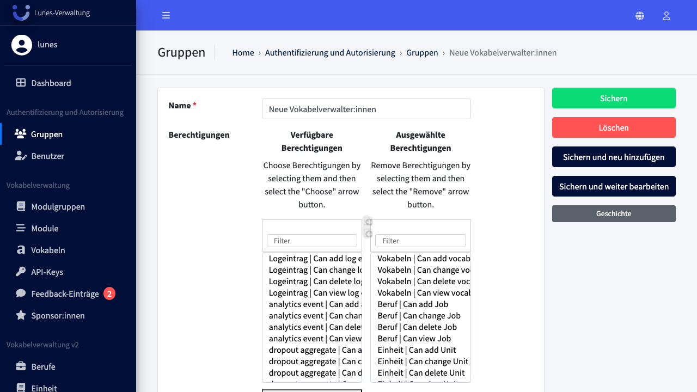
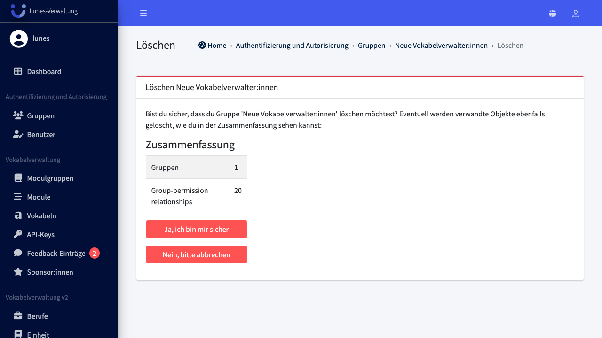

# Delete Group

## Schritt 1: Gruppen-Bereich öffnen

Klicken Sie im linken Navigationsmenü im Bereich **„Authentifizierung und Autorisierung"** auf **„Gruppen"**.

## Schritt 2: Gruppe auswählen

Klicken Sie auf die Gruppe **„Neue Vokabelverwalter:innen"**, um sie zu öffnen.

## Schritt 3: Gruppe löschen

Klicken Sie unten links auf **„Löschen"**.

## Schritt 4: Löschen bestätigen

Bestätigen Sie das Löschen mit einem Klick auf **„Ja, ich bin sicher"**.

