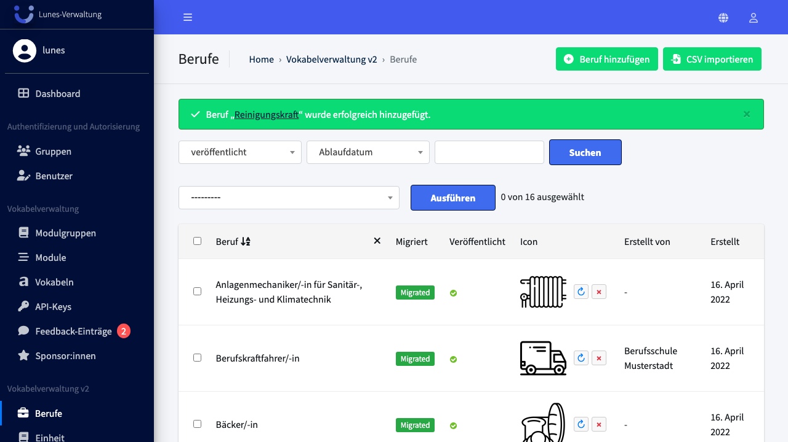
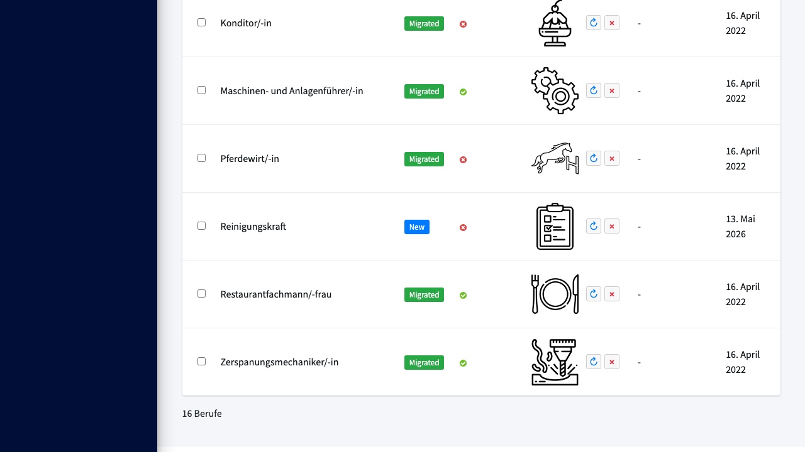
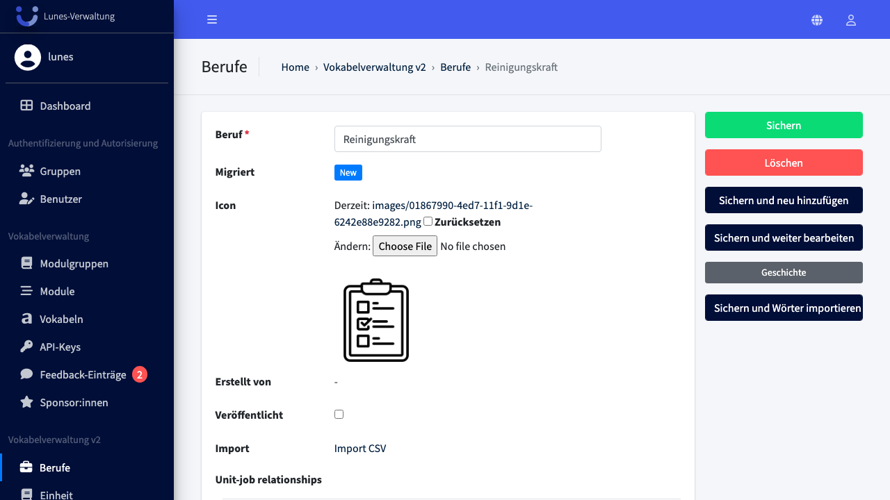
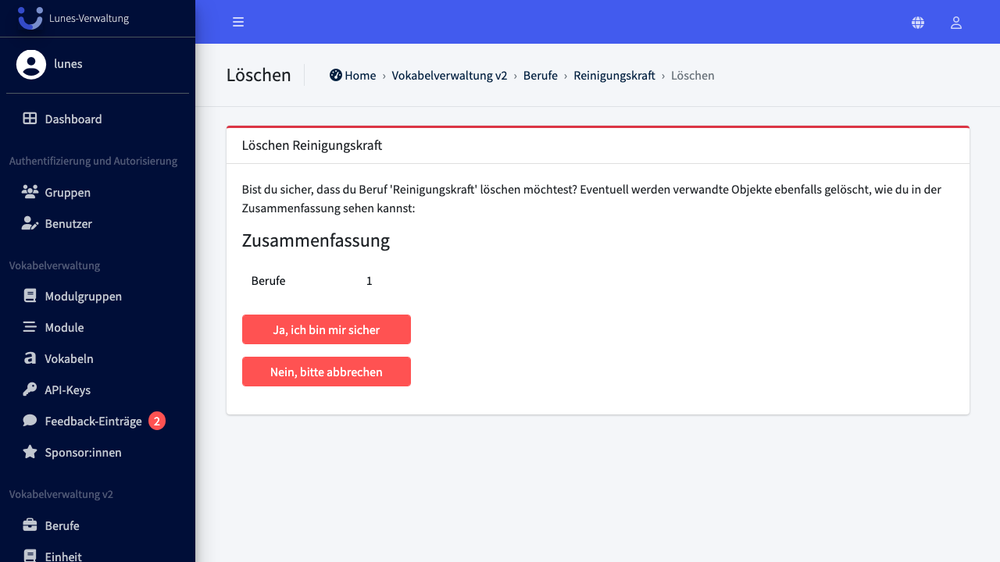

# Delete Job

## Schritt 1: Berufe-Bereich öffnen

Klicken Sie im linken Navigationsmenü auf **Berufe**.

## Schritt 2: Beruf öffnen

Klicken Sie auf den Beruf **„Reinigungskraft"** in der Liste.

## Schritt 3: Beruf löschen

Klicken Sie rechts auf **„Löschen"**.

## Schritt 4: Löschung bestätigen

Bestätigen Sie die Löschung mit einem Klick auf **„Ja, ich bin sicher"**.

