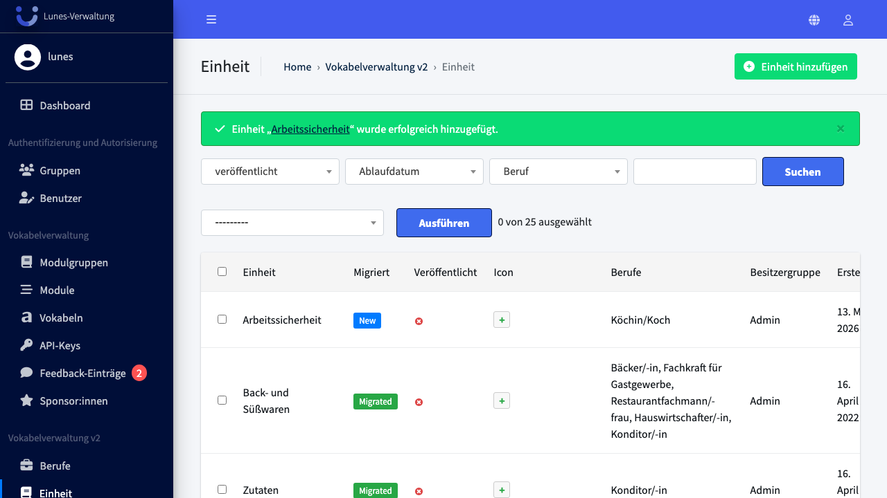
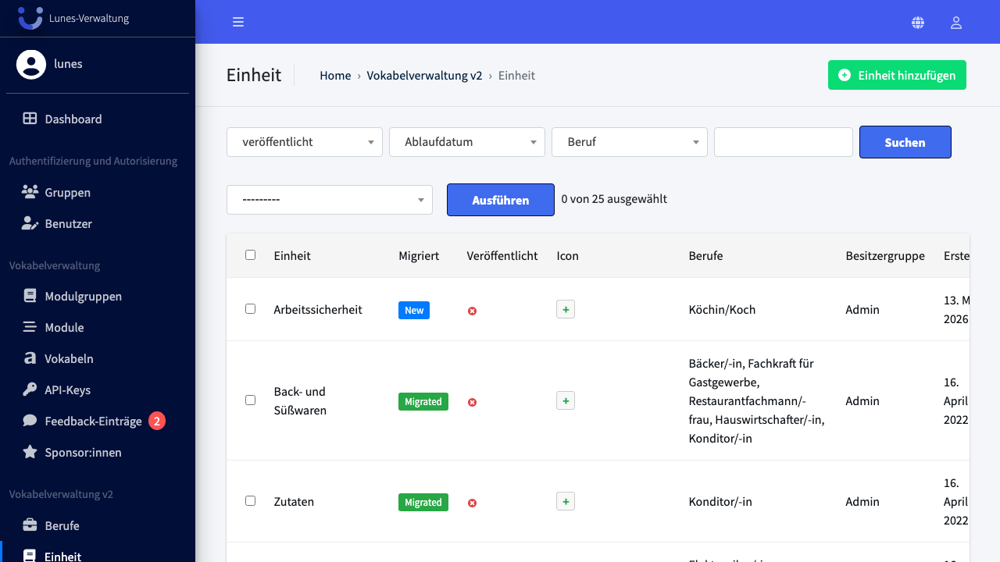
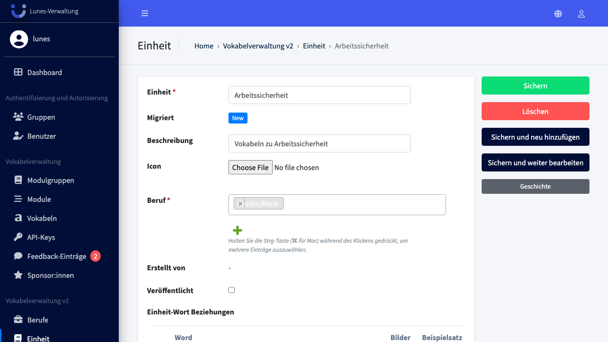
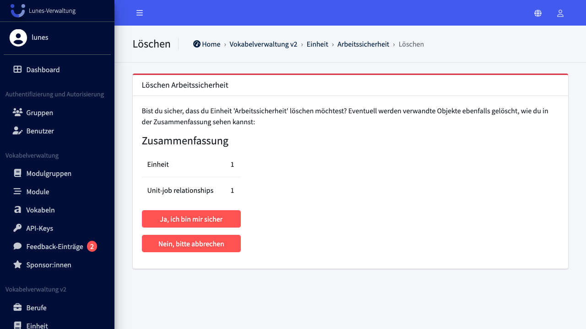

# Delete Unit

## Schritt 1: Einheit-Bereich öffnen

Klicken Sie im linken Navigationsmenü auf **Einheit**.

## Schritt 2: Einheit öffnen

Klicken Sie auf die Einheit **„Arbeitssicherheit"** in der Liste.

## Schritt 3: Einheit löschen

Klicken Sie rechts auf **„Löschen"**.

## Schritt 4: Löschung bestätigen

Bestätigen Sie die Löschung mit einem Klick auf **„Ja, ich bin sicher"**.

