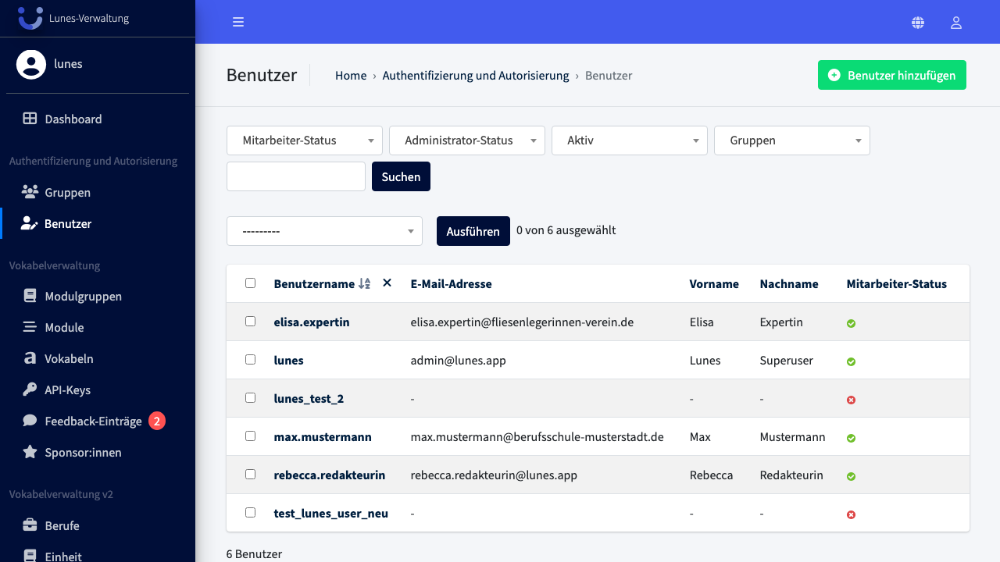
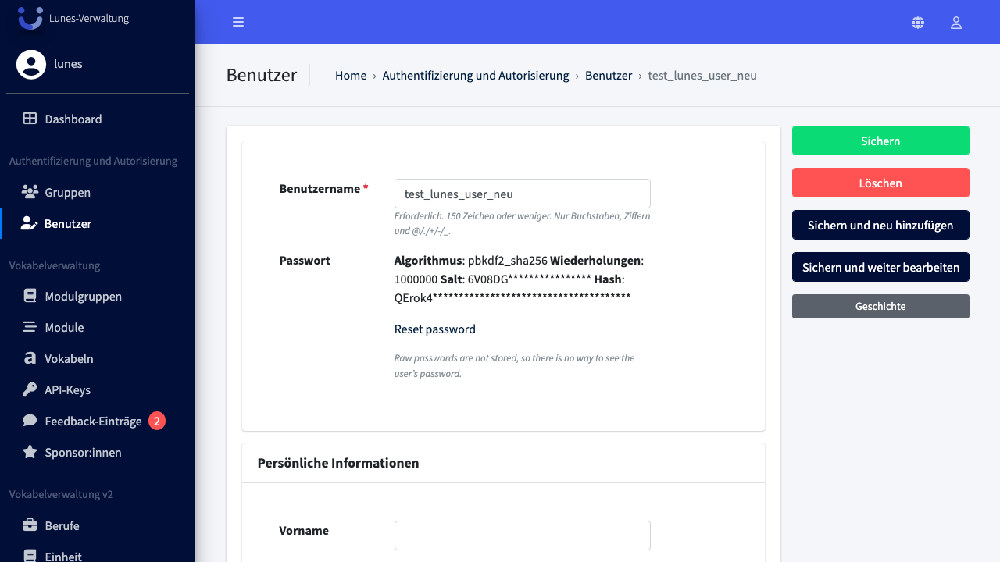
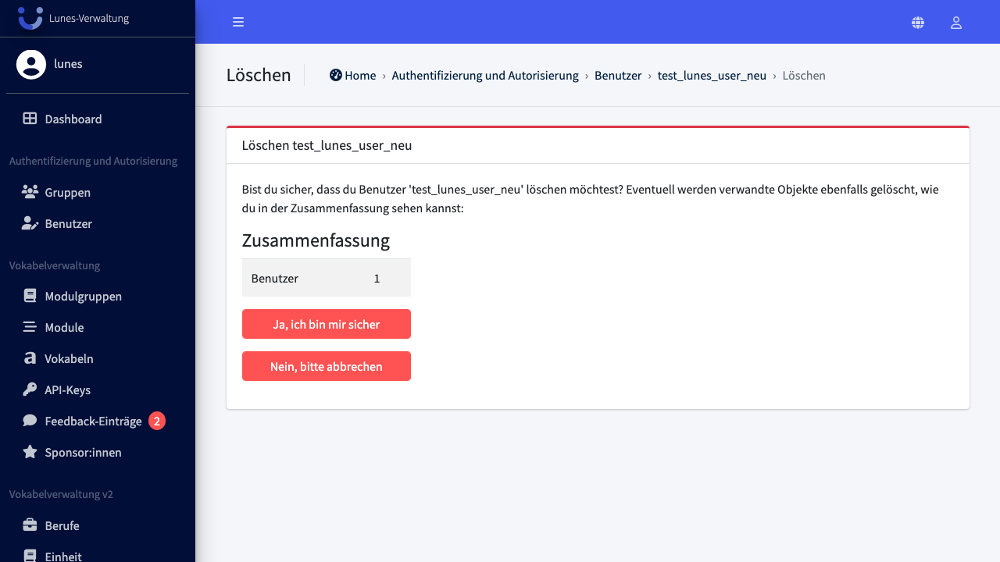

# Delete User

## Schritt 1: Benutzer-Bereich öffnen

Klicken Sie im linken Navigationsmenü im Bereich **„Authentifizierung und Autorisierung"** auf **„Benutzer"**, um die Übersicht aller Benutzer:innen zu öffnen.

## Schritt 2: Benutzer:in löschen

Wählen Sie die Benutzer:in **„test_lunes_user_neu"** aus und klicken Sie rechts oben auf **„Löschen"**.

## Schritt 3: Löschung bestätigen

In der Zusammenfassung wird **„Benutzer: 1"** angezeigt. Bestätigen Sie die Löschung mit einem Klick auf **„Ja, ich bin sicher"**.

