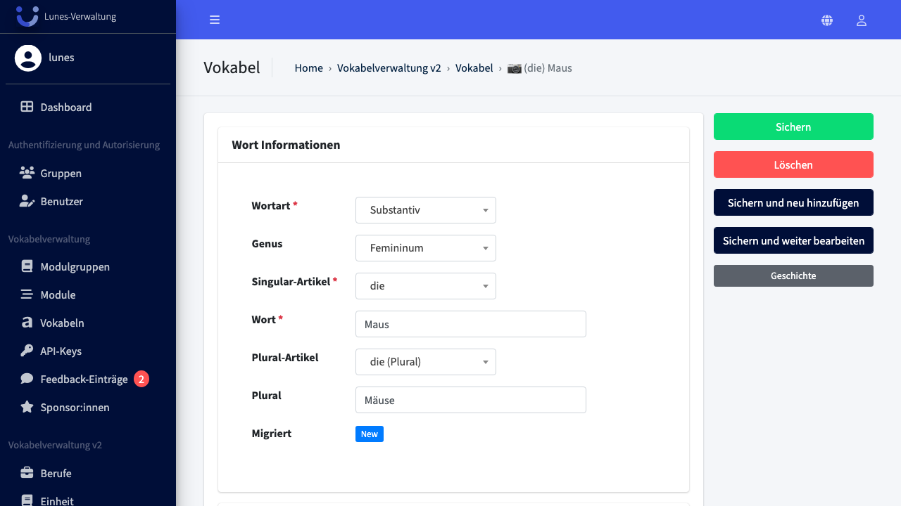
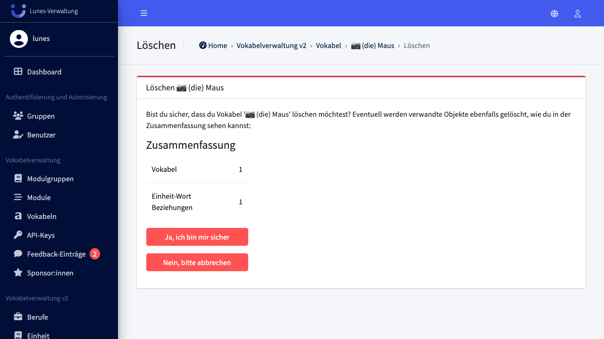

# Delete Word

## Schritt 1: Vokabel-Bereich öffnen

Scrollen Sie im linken Navigationsmenü zu **Vokabel** und klicken Sie darauf.

## Schritt 2: Vokabel öffnen

Suchen Sie nach **„Maus"** und klicken Sie auf den Eintrag in der Liste.

## Schritt 3: Vokabel löschen

Klicken Sie rechts auf **„Löschen"**.

## Schritt 4: Löschung bestätigen

Bestätigen Sie die Löschung mit einem Klick auf **„Ja, ich bin sicher"**.

