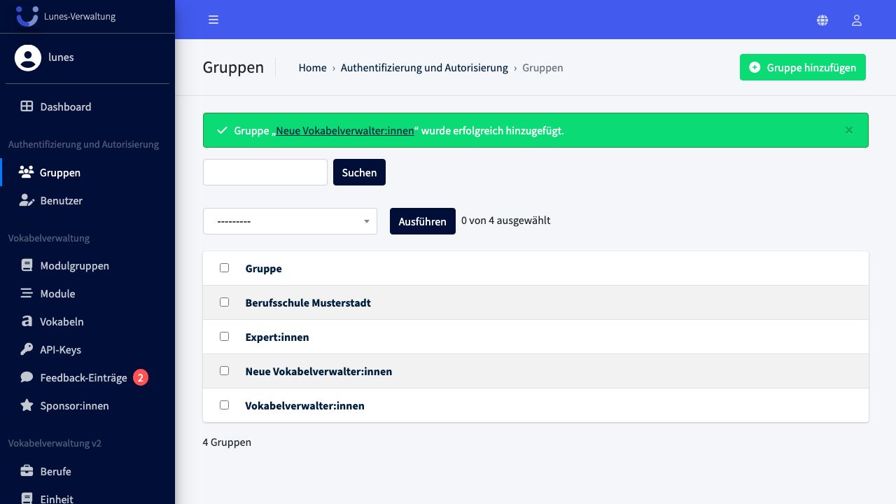
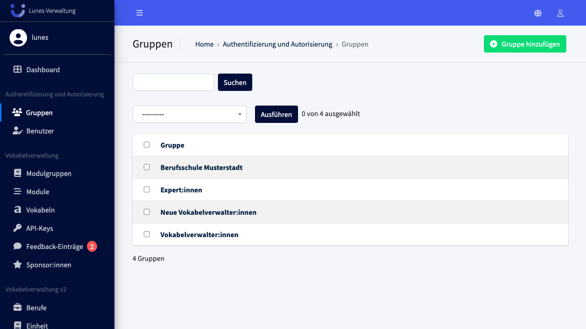
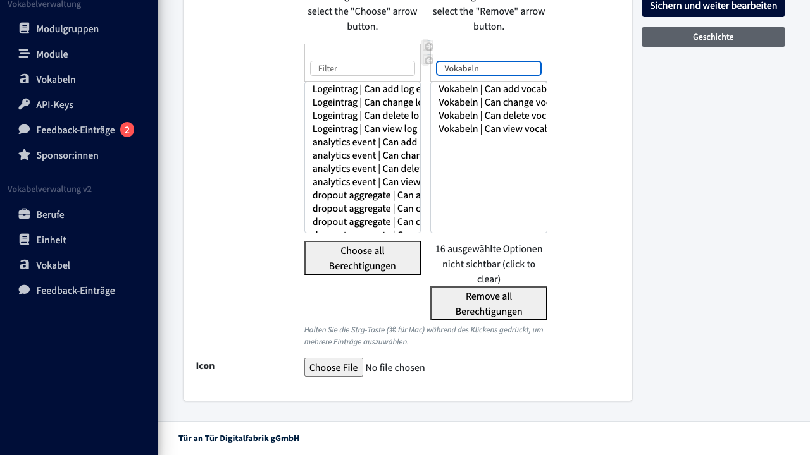
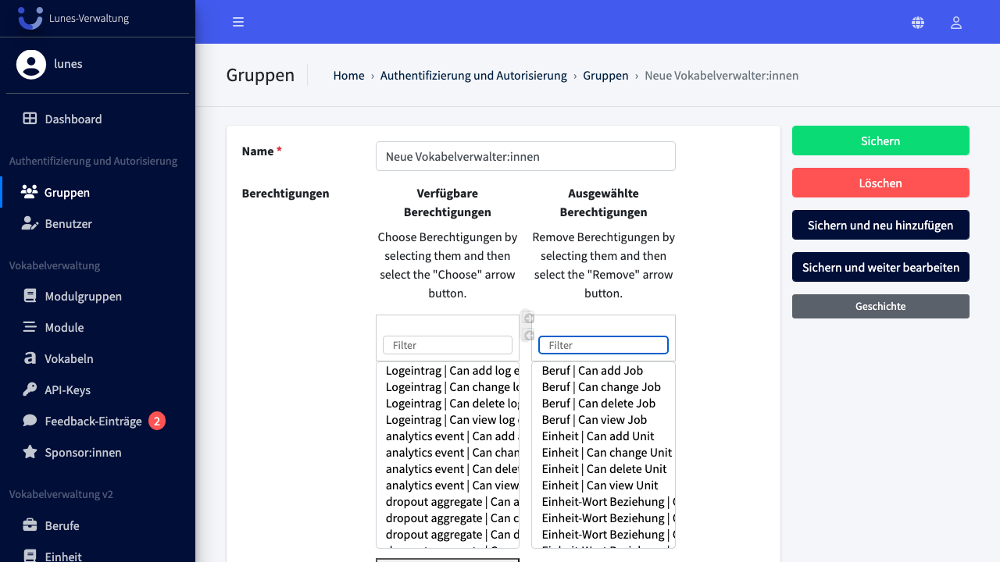

# Edit Group

## Schritt 1: Gruppen-Bereich öffnen

Klicken Sie im linken Navigationsmenü im Bereich **„Authentifizierung und Autorisierung"** auf **„Gruppen"**.

## Schritt 2: Gruppe auswählen

Klicken Sie auf die Gruppe **„Neue Vokabelverwalter:innen"**, um sie zu öffnen.

## Schritt 3: Berechtigungen filtern und entfernen

Nutzen Sie das Suchfeld über den ausgewählten Berechtigungen, um nach einer Kategorie zu filtern. Klicken Sie dann auf **„Remove all Berechtigungen"**, um alle gefilterten Einträge zu entfernen.

## Schritt 4: Änderungen speichern

Klicken Sie auf **„Sichern"**, um die Änderungen zu speichern.

