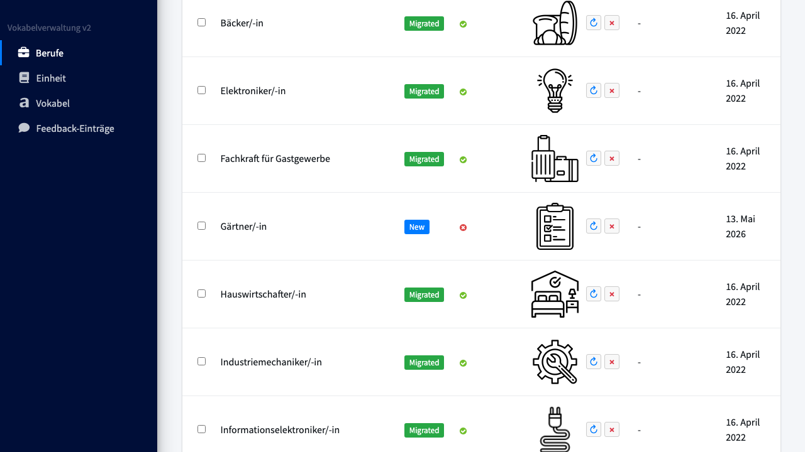
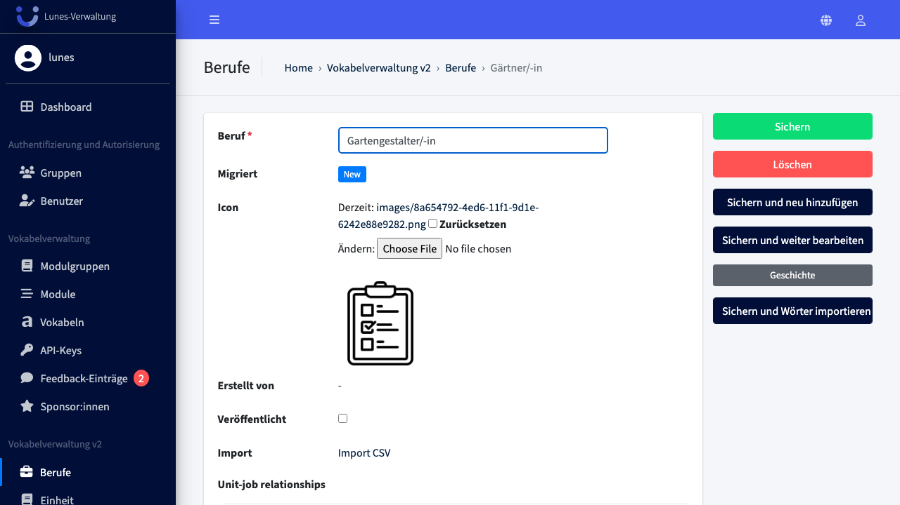

# Edit Job

## Schritt 1: Beruf-Bereich öffnen

Klicken Sie im linken Navigationsmenü auf **Berufe**.

## Schritt 2: Beruf öffnen

Klicken Sie auf den Beruf den Sie editieren wollen z.B. **„Gärtner/-in"** in der Liste.

## Schritt 3: Beruf umbenennen und speichern

Ändern Sie den Namen im Feld **„Beruf"** auf `Gartengestalter/-in` und klicken Sie auf **„Sichern"**.

## Schritt 4: Erfolg — Beruf wurde aktualisiert

Der umbenannte Beruf **„Gartengestalter/-in"** erscheint nun in der Berufs-Übersicht.

