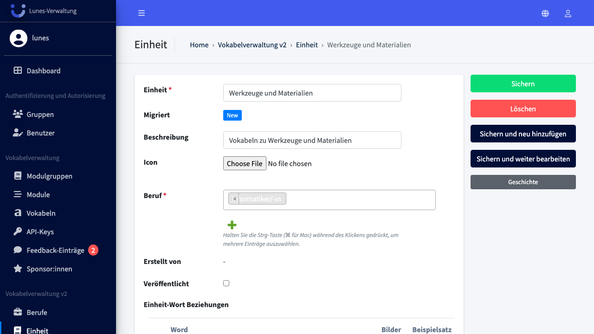
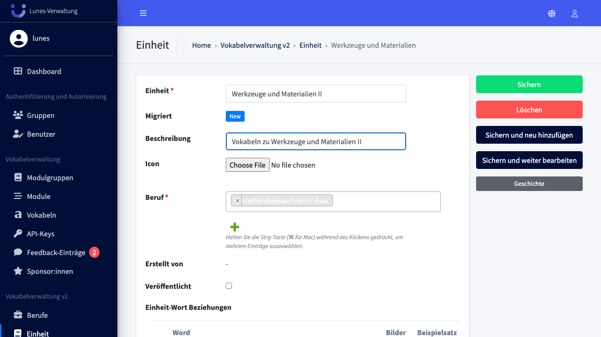
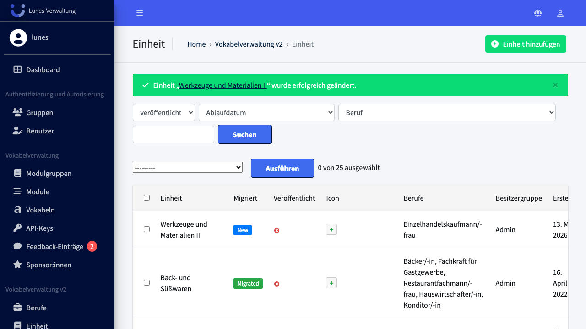

# Edit Unit

## Schritt 1: Einheit-Bereich öffnen

Klicken Sie im linken Navigationsmenü auf **Einheit**.

## Schritt 2: Zur Einheit navigieren und öffnen

Scrollen Sie in der Übersicht zu einer Einheit z.B. **„Werkzeuge und Materialien"** und klicken Sie darauf.

## Schritt 3: Felder anpassen

Passen Sie die entsprechenden Felder an.

## Schritt 4: Änderungen speichern

Klicken Sie auf **„Sichern"**, um die Änderungen zu speichern.

## Schritt 5: Erfolg — Einheit wurde aktualisiert

Die Einheit **„Werkzeuge und Materialien II"** wurde erfolgreich gespeichert.

