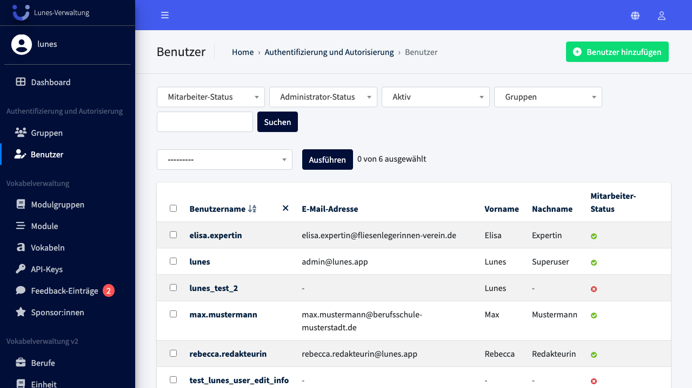
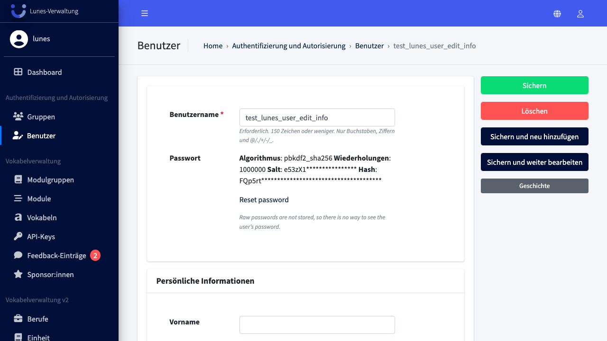
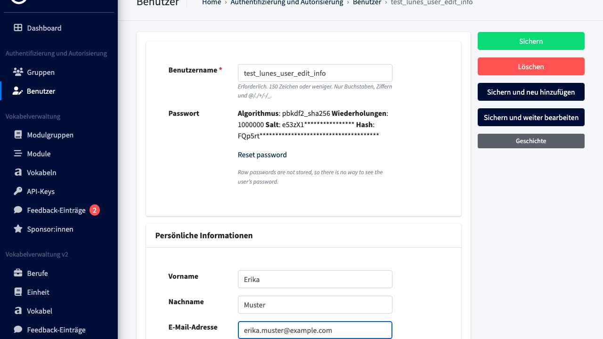

# Edit User Information

## Schritt 1: Benutzer-Bereich öffnen

Wählen Sie im Navigationsmenü **„Benutzer"**, um die Übersicht aller Benutzer:innen zu öffnen.

## Schritt 2: Benutzer:in auswählen

Wählen Sie die Benutzer:in **„test_lunes_user_edit_info"** aus der Liste aus.

## Schritt 3: Persönliche Informationen eingeben

Scrollen Sie zum Bereich **„Persönliche Informationen"** und füllen Sie die Felder **„Vorname"**, **„Nachname"** und **„E-Mail-Adresse"** aus.

## Schritt 4: Änderungen speichern

Scrollen Sie wieder nach oben und klicken Sie auf **„Sichern"**.

