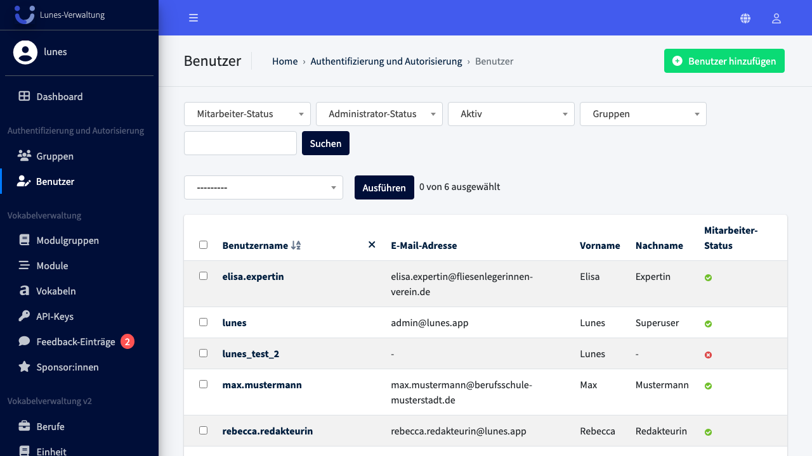
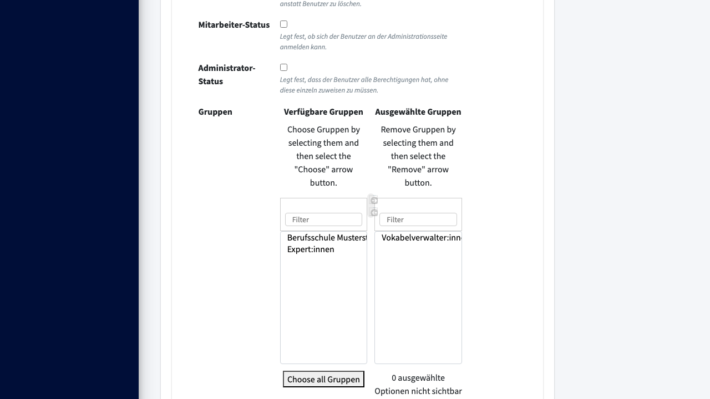
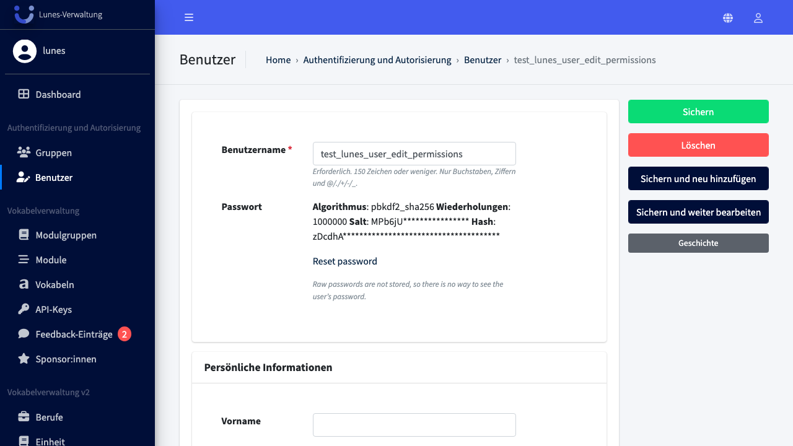

# Edit User Permissions

## Schritt 1: Benutzer-Bereich öffnen

Wählen Sie im Navigationsmenü **„Benutzer"**, um die Übersicht aller Benutzer:innen zu öffnen.

## Schritt 2: Benutzer:in auswählen

Wählen Sie die Benutzer:in **„test_lunes_user_edit_permissions"** aus der Liste aus.

## Schritt 3: Gruppe zuweisen

Scrollen Sie zum Bereich **„Berechtigungen"**, wählen Sie **„Vokabelverwalter:innen"** aus den verfügbaren Gruppen aus und klicken Sie auf den Hinzufügen-Button. Die Gruppe erscheint nun unter **„Ausgewählte Gruppen"**.

## Schritt 4: Änderungen speichern

Scrollen Sie wieder nach oben und klicken Sie auf **„Sichern"**.

