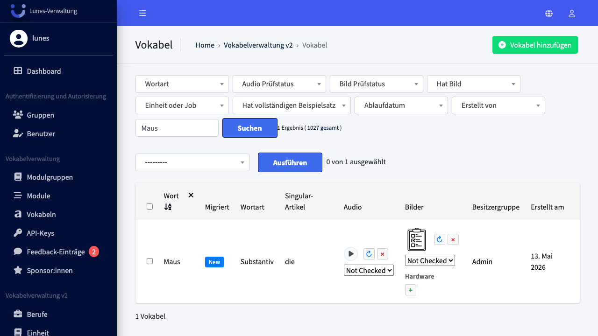
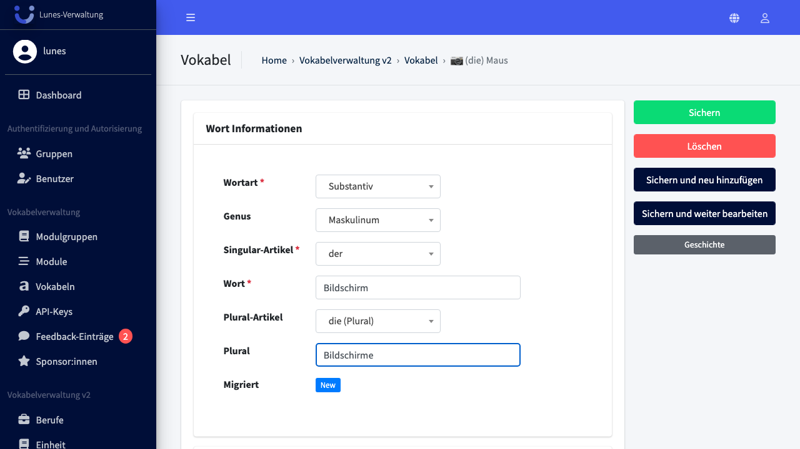
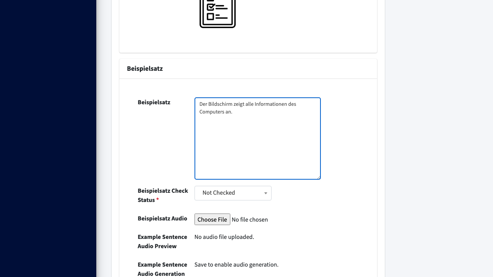
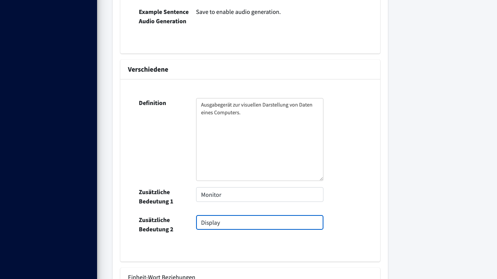
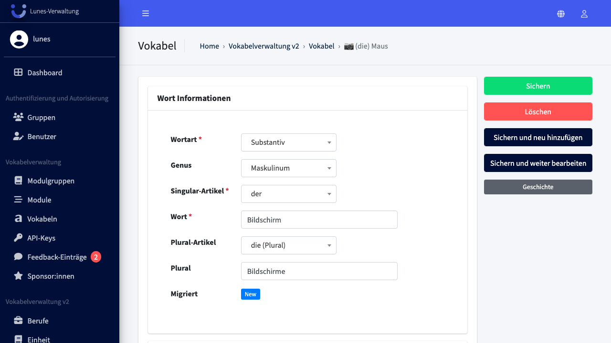
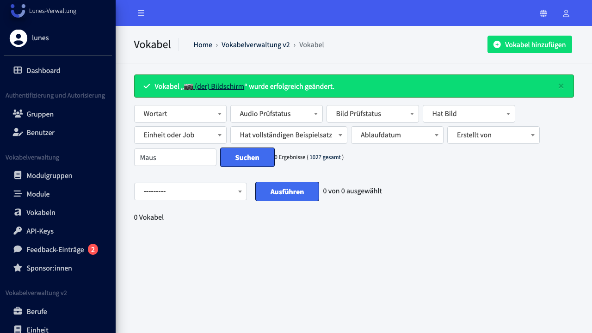

# Edit Word

## Schritt 1: Vokabel-Bereich öffnen

Scrollen Sie im linken Navigationsmenü zu **Vokabel** und klicken Sie darauf.

## Schritt 2: Vokabel öffnen

Suchen Sie nach einem Wort z.B. **„Maus"** und klicken Sie auf den Eintrag in der Liste.

## Schritt 3: Vokabel Information anpassen

Ändern Sie das Genus auf **„Maskulinum"**, den Artikel auf **„der"** und das Wort auf **„Bildschirm"** mit Plural **„Bildschirme"**.

## Schritt 4: Beispielsatz anpassen

Ändern Sie den Beispielsatz auf `Der Bildschirm zeigt alle Informationen des Computers an.`.

## Schritt 5: Verschiedenes anpassen

Ändern Sie die **„Definition"** sowie **„Zusätzliche Bedeutung 1+2"**.

## Schritt 6: Änderungen speichern

Klicken Sie auf **„Speichern"**, um die Änderungen zu speichern.

## Schritt 7: Erfolg — Wort wurde aktualisiert

Das aktualisierte Wort **„Bildschirm"** erscheint nun in der Übersicht.

