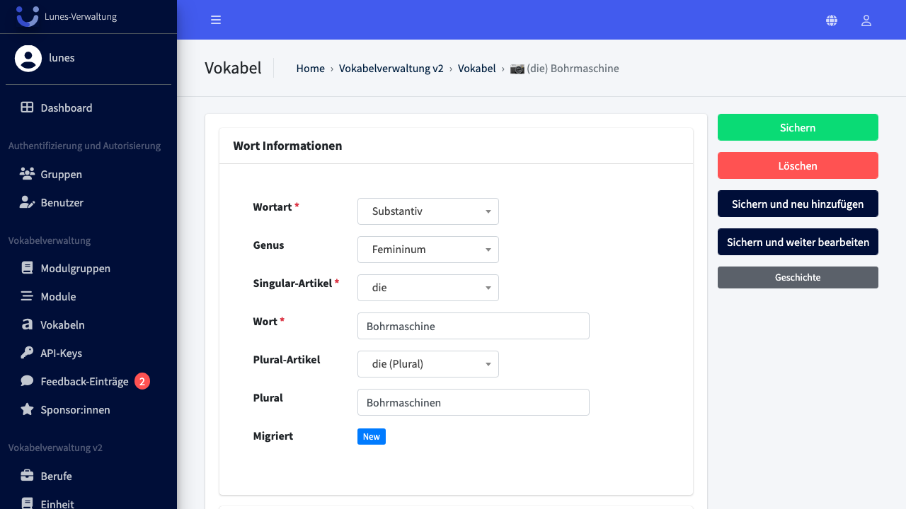
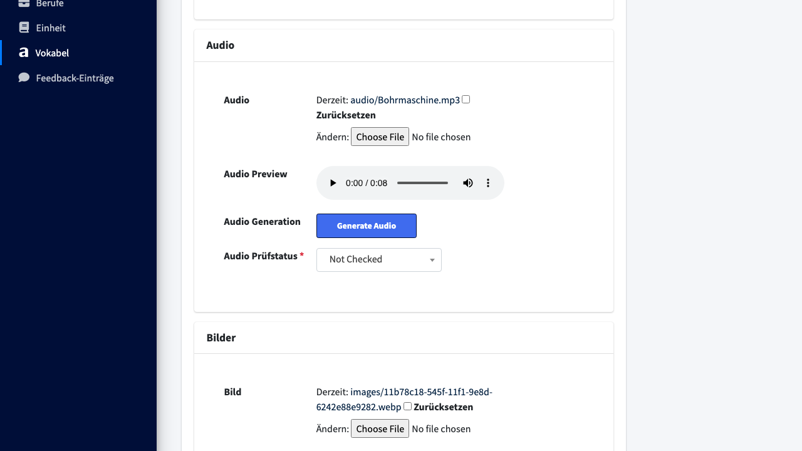
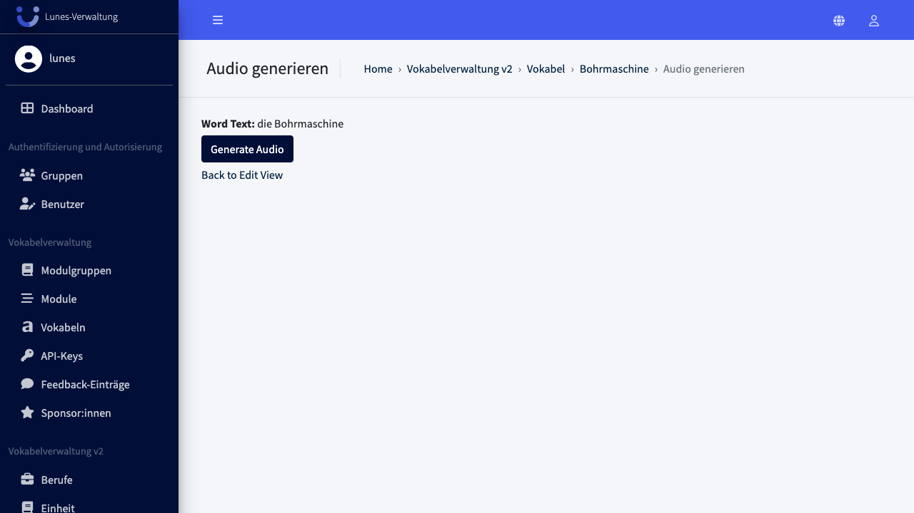
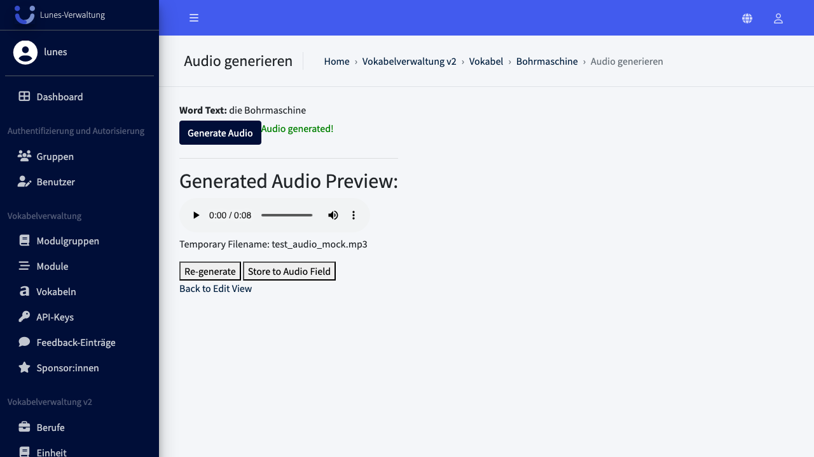
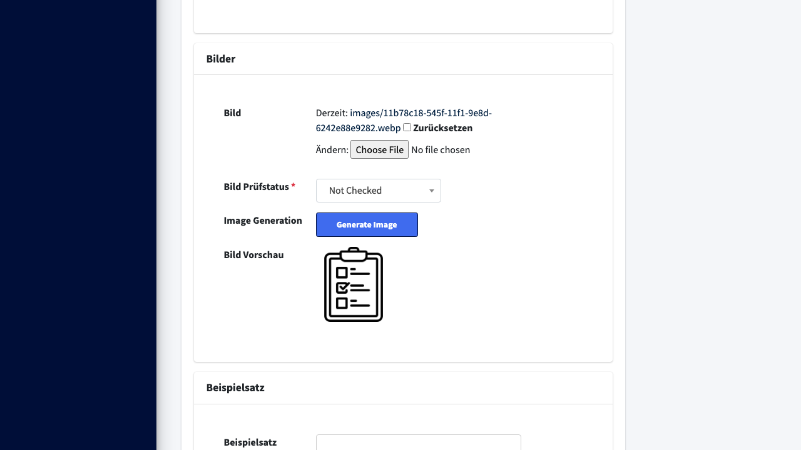
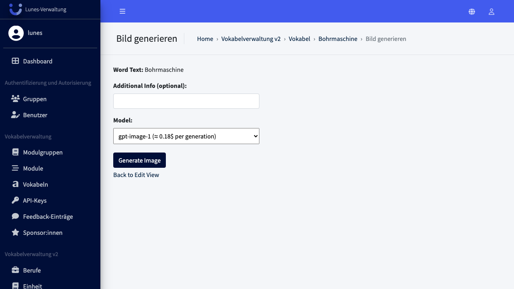
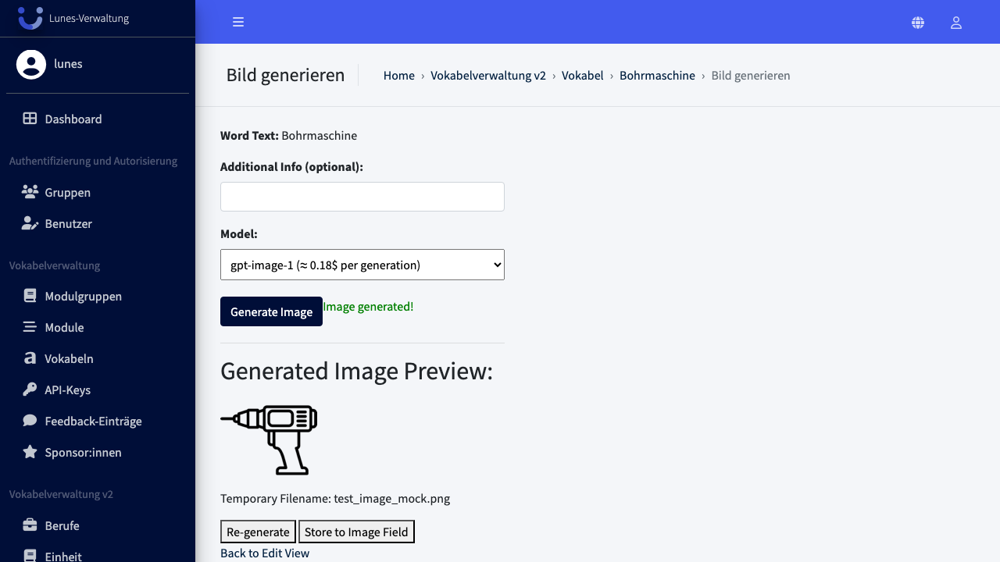

# Generate Word Audio And Image

## Schritt 1: Öffnen Sie ein Wort

Navigieren Sie zur Wort-Detailseite.

## Schritt 2: Audio-Generator öffnen

Scrollen Sie zum Bereich **„Audio"** und klicken Sie auf den Button **„Generate Audio"**, um zur KI-Audio-Generierung zu gelangen.

## Schritt 3: Audio generieren

Klicken Sie auf **„Generate Audio"**. Nach kurzer Ladezeit erscheint eine Vorschau des generierten Audios.

## Schritt 4: Generiertes Audio speichern

Klicken Sie auf **„Store to Audio Field"**, um das generierte Audio dauerhaft dem Wort zuzuweisen.

## Schritt 5: Zum Bereich Bilder scrollen

Scrollen Sie auf der Wort-Detailseite zum Bereich **„Bilder"** und klicken Sie auf den Button **„Generate Image"**.

## Schritt 6: Bild generieren

Klicken Sie auf **„Generate Image"**. Nach kurzer Ladezeit erscheint eine Vorschau des generierten Bildes.

## Schritt 7: Generiertes Bild speichern

Klicken Sie auf **„Store to Image Field"**, um das generierte Bild dauerhaft dem Wort zuzuweisen.

