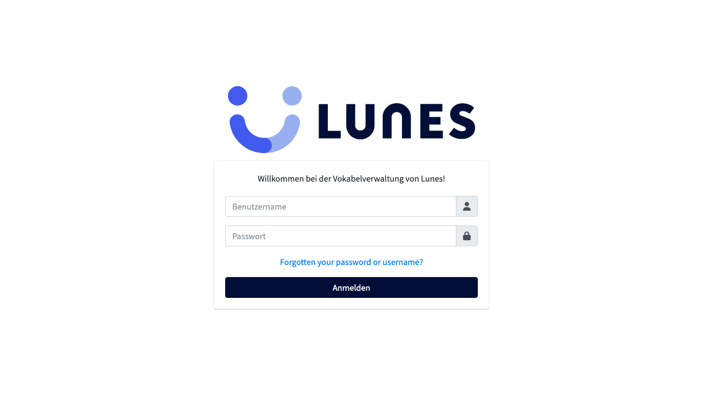
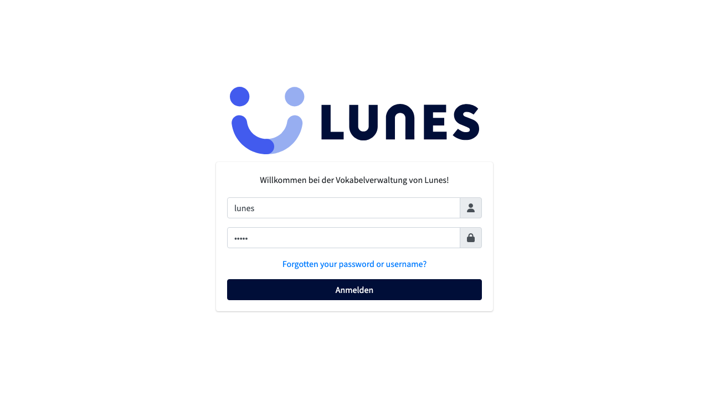

# Login

## Schritt 1: Lunes CMS im Browser aufrufen

Rufen Sie folgende URL auf: http://localhost:8080

## Schritt 2: Anmeldedaten eingeben

Geben Sie Ihren Benutzernamen und Ihr Passwort in die entsprechenden Felder ein.

## Schritt 3: Anmelden — Dashboard wird geöffnet

Klicken Sie auf den Anmelden-Button. Sie werden zum Dashboard weitergeleitet.

