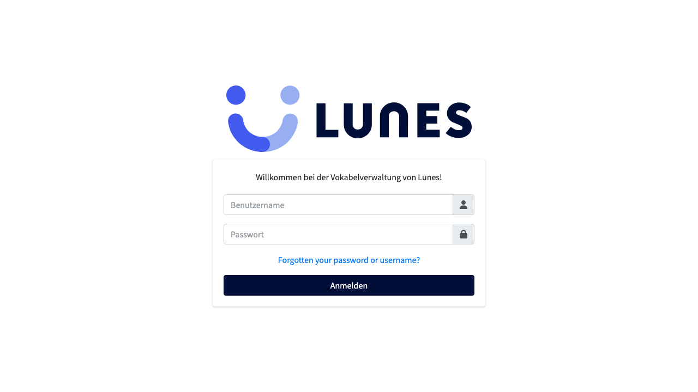
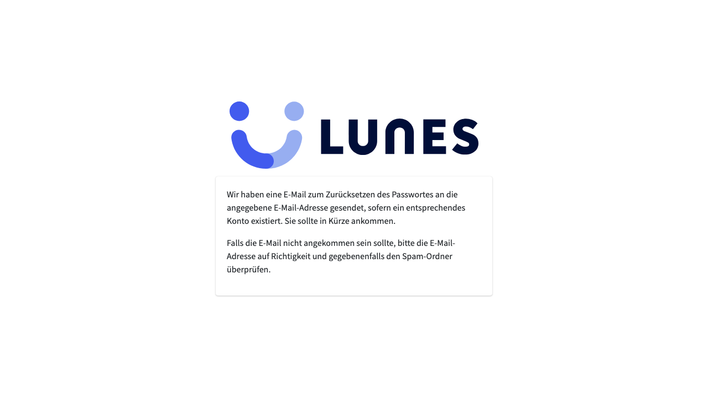
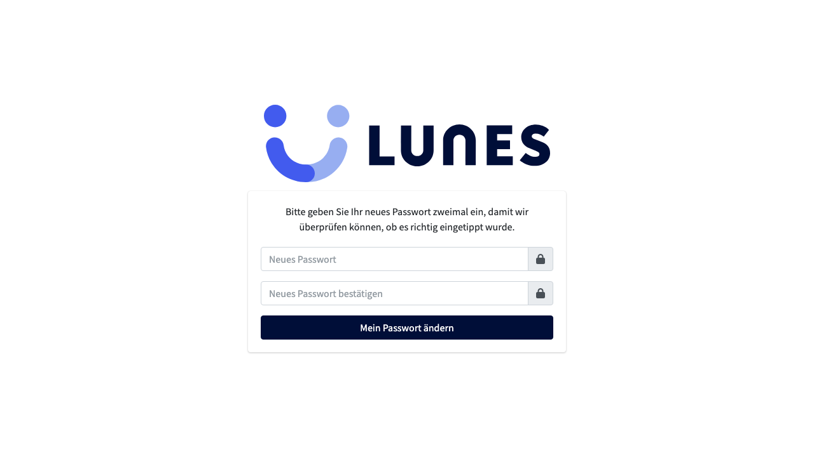
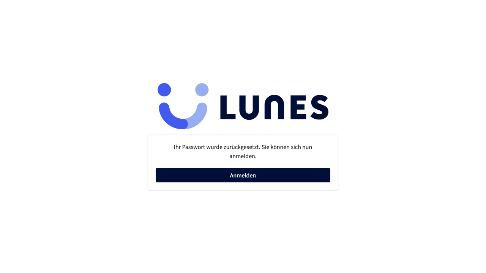

# Password Reset

## Schritt 1: Passwort vergessen – Formular aufrufen

Klicken Sie auf der Anmeldeseite auf "Forgotten your password or username?" oder rufen Sie die Seite direkt auf.

## Schritt 2: E-Mail-Adresse eingeben

Geben Sie Ihre registrierte E-Mail-Adresse ein und klicken Sie auf Absenden.

## Schritt 3: Bestätigungsseite

Sie erhalten in Kürze eine E-Mail mit einem Link zum Zurücksetzen Ihres Passworts.

## Schritt 4: Neues Passwort festlegen

Folgen Sie dem Link in der E-Mail und geben Sie ein neues Passwort ein.

## Schritt 5: Passwort erfolgreich zurückgesetzt

Ihr Passwort wurde erfolgreich geändert. Sie können sich jetzt mit dem neuen Passwort anmelden.

